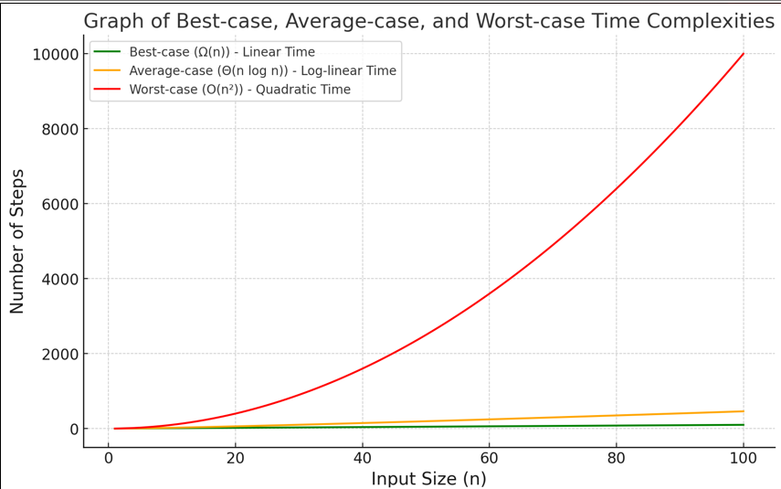

## Data Structure :
- A way of organizing and storing data so that it can be accessed and modified efficiently.
- Data structures define the layout of data in memory and help improve the performance of operations like searching, sorting, and inserting.
- Example: Array, Linked List, Trees, Graph

### Algorithm:
- A finite sequence of well-defined instructions to solve a problem or perform a task. Algorithms are focused on optimizing time and space.
- Example: Searching, Sorting
- Why DSA:
    - Optimization
    - Coding Interviews 
    - Real-world Applications

### About Complexities:
- DSA the main goal is to solve problems effectively and efficiently.
- To determine the efficiency of a program, we look at two types of complexities:
    - Time Complexity: This tells us how much time our code takes to run.
    - Space Complexity: This tells us how much memory our code uses.

### Asymptotic Notation
- We use asymptotic notation to compare the efficiencies of algorithms.
- It’s a mathematical tool that estimates time based on input size without running the code.
- Its focus is on how many basic operations the program performs, giving us an idea of how the algorithm behaves as input size increases.

#### Types of Asymptotic Notations:
- Big O (O): Describes the worst-case scenario or the upper bound of how the algorithm performs as the input size increases.
- Omega (Ω): Describes the best-case scenario or the lower bound.
- Theta (Θ): Describes the average-case or how the algorithm performs generally as input grows.

We are interested in the rate of growth over time with respect to the inputs taken during the program execution.

### Complexities:
- O(1)- Constant Time
    - No matter the size of the array, accessing any element takes a constant time (1 step).
    - Example: Accessing a specific element in an array by index.
    - Code Example (Array Access):

            int[] arr = {1, 2, 3, 4, 5};
            int element = arr[2]; // Accessing the 3rd element
    - Explanation: No matter how large the array is, accessing any element by its index will always take the same constant time. Therefore, the time complexity is O(1).
- O(log n) – Logarithmic Time
    - The algorithm cuts the problem size in half with each step, so the time grows logarithmically.
    - Example: Binary search in a sorted array.
    - Code Example (Binary Search):

            int binarySearch(int[] arr, int target) {
                int left = 0, right = arr.length - 1;
                while (left <= right) {
                    int mid = left + (right - left) / 2;
                    if (arr[mid] == target) {
                        return mid;
                    } else if (arr[mid] < target) {
                        left = mid + 1;
                    } else {
                        right = mid - 1;
                    }
                }
                return -1;
            }
    - Explanation: Binary search divides the input size in half after each comparison. Therefore if the input size doubles, the number of comparisons only increases by one. For example, in an array of size 1000, binary search only needs about 10 comparisons, which is logarithmic growth. Hence, the complexity is O(log n).
- O(n) – Linear Time
    - The time grows directly proportional to the size of the input.
    - Example: Traversing an array of size, Linear Search, Single loops
    - Code Example (Linear Search):

            int linearSearch(int[] arr, int target) {
                for (int i = 0; i < arr.length; i++) {
                    if (arr[i] == target) {
                        return i; // Found the target
                    }
                }
                return -1; // Target not found
            }
    - Explanation: The algorithm goes through each element one by one, so the number of steps grows directly in proportion to the input size. If there are 10 elements, it checks 10 times. If there are 1000 elements, it checks 1000 times, hence O(n).
- O(n log n) – Linearithmic Time
    - The algorithm divides the input into subproblems (logarithmic) and processes each subproblem linearly
    - Example: Merge Sort or Quick Sort in average cases.
    - Code Example (Merge Sort):

            void mergeSort(int[] arr, int left, int right) {
                if (left < right) {
                    int mid = (left + right) / 2;
                    mergeSort(arr, left, mid);
                    mergeSort(arr, mid + 1, right);
                    merge(arr, left, mid, right); // Merge the two halves
                }
            }
    - Explanation: Merge Sort splits the array in half recursively and then merges the sorted halves. The splitting takes log n time (because the array is divided in half repeatedly), and merging takes n time at each level. This results in O(n log n) time complexity, which is much faster than O(n²) for larger inputs.
- O(n²) – Quadratic Time
    - As the input grows, the time taken increases quadratically.
    - Example: Bubble sort or checking all pairs in an array, Selection Sort
    - Code Example (Bubble Sort):

            void bubbleSort(int[] arr) {
                for (int i = 0; i < arr.length - 1; i++) {
                    for (int j = 0; j < arr.length - i - 1; j++) {
                        if (arr[j] > arr[j+1]) {
                            // Swap arr[j] and arr[j+1]
                            int temp = arr[j];
                            arr[j] = arr[j+1];
                            arr[j+1] = temp;
                        }
                    }
                }
            }
    - Explanation: In Bubble Sort, the outer loop runs n times and the inner loop also runs n times for each pass. This results in n * n = n² steps, so the time complexity is O(n²). For a small number of elements, this may not be a problem, but as the input grows, the time taken increases significantly.
- O(2^n) — Exponential Time Complexity
    - The time grows exponentially with the size of the input, meaning it doubles with each additional input.
    - Recursive algorithms that solve a problem by breaking it into multiple smaller subproblems, such as calculating Fibonacci numbers using recursion.
    - Code Example (Naive Recursive Fibonacci):

            int fibonacci(int n) {
                if (n <= 1) {
                    return n;
                }
                return fibonacci(n - 1) + fibonacci(n - 2);
            }
    - Explanation: In this recursive Fibonacci function, each call to fibonacci(n) results in two further calls to fibonacci(n-1) and fibonacci(n-2) . As n increases, the number of recursive calls grows exponentially, resulting in O(2^n) time complexity. This becomes impractical for even moderate values of n .
- O(n!) - Factorial Time Complexity
    - Factorial time complexity occurs in algorithms that involve generating all possible permutations of a set, such as the brute-force solution for the Traveling Salesman Problem.
    - Example: Generating all permutations, TSP
    - Code Example (Permutations):

            void permute(char[] arr, int l, int r) {
                if (l == r) {
                    System.out.println(Arrays.toString(arr));
                } else {
                    for (int i = l; i <= r; i++) {
                        swap(arr, l, i);
                        permute(arr, l+1, r);
                        swap(arr, l, i); // Backtrack
                    }
                }
            }
    - Explanation: In this algorithm, each element has n! possible permutations, meaning the number of possible solutions grows factorially as the input size increases. For an input of size n , the algorithm has O(n!) time complexity, which is extremely inefficient for large inputs.
- Execution order
        $$
        O(1) < O(\log \log n) < O(\log n) < O(\sqrt{\log n}) < O(n) < O(n \log n) < O(n^2) < O(n^3) < O(n^k) < O(2^n)
        $$
    - Constant time O(1): Fastest, does not depend on n.
    - Double logarithmic O(log log n): Grows slower than O(log n).
    - Logarithmic O(log n): Common in binary search.
    - Square root log O(√log n): Slightly larger than O(log n).
    - Linear O(n): Direct proportional growth.
    - Linearithmic O(n log n): Used in efficient sorting algorithms (e.g., Merge Sort).
    - Quadratic O(n²): Nested loops, common in brute-force algorithms.
    - Cubic O(n³): More nested iterations.
    - Polynomial O(n^k): Growth based on k, where k > 3.
    - Exponential O(2^n): Very fast-growing, common in brute-force recursion.
- Summary:

        Time Complexity         Example Algorithm                Description
            O(1)            Accessing an element in an      Constant time, no matter the input  
                            in an array                     size
            O(log n)        Binary Search                   Halves the problem size with each step
            O(n)            Linear Search, Single loops     Grows linearly with the input size
            O(n log n)      Merge Sort, Quick Sort          Log-linear time, use in good sorting  
            O(n²)           Bubble Sort, Selection Sort     Quadratic time, nested loops
            O(2^n)          Recursive Fibonacci             Exponential time, doubles with each
                                                            added input
            O(n!)           Permutations, TSP               Factorial time, grows very fast
                                                            with input size

### How to find complexity:

- Step 1: Identify the loops or recursive calls in your algorithm.
    - If the algorithm has a single loop that runs n times, the time complexity is O(n).
    - If there is a nested loop, the time complexity could be O(n²), O(n * m), or higher. 
- Step 2: For each operation, figure out how many times it runs as the input grows.
    - Constant time operations (like simple arithmetic) are O(1).
    - Recursive algorithms may have more complex time complexities that depend on the depth of recursion.
- Step 3: Drop constants and non-dominant terms.
    - If you have O(n + 100), it's simply O(n) because constants don't matter in Big O notation.
    - For example, O(n2 + n) is simplified to O(n2) because the quadratic term
dominates.

    
## ADT and Array

### Abstract Data Type (ADT):
Abstract Data Type (ADT) is a model for a data structure that defines the behavior
of the data type without specifying its implementation. It focuses on what
operations a data type can perform rather than how it performs those operations.

#### Key Features of ADT:
1. Encapsulation of Data and Operations:
ADTs hide the internal representation of data. Users interact with the data
only through a set of well-defined operations, which ensures that the data
is safe from unintended interference.
2. Separation of Interface and Implementation:
The ADT defines an interface (a set of operations), but how those
operations are implemented is not exposed. This allows for flexibility in
implementation.
3. Reusability:
Since the implementation is hidden, ADTs can be easily reused or changed
without affecting the rest of the code that relies on them.

#### Example of ADT: Stack
A stack is a classic example of an ADT that operates on the Last In, First Out
(LIFO) principle.
1. Operations:
    - push(item) : Add an item to the top of the stack.
    - pop() : Remove and return the item from the top of the stack.
    - peek() : Return the item at the top of the stack without removing it.
    - isEmpty() : Check if the stack is empty.
    - size() : Return the number of items in the stack.
2. Implementation:
    The implementation can vary: a stack can be implemented using arrays,
linked lists, or any other data structure, but this is hidden from the user.
- Example Code (Java):

        // Stack ADT Interface
        public interface StackADT<T> {
            void push(T item);
            T pop();
            T peek();
            boolean isEmpty();
            int size();
        }
        // Array-based Stack Implementation
        public class ArrayStack<T> implements StackADT<T> {
            private T[] stack;
            private int top;
            private int capacity;
            @SuppressWarnings("unchecked")
            public ArrayStack(int capacity) {
                this.capacity = capacity;
                stack = (T[]) new Object[capacity];
                top = -1;
            }
            @Override
            public void push(T item) {
                if (top == capacity - 1) {
                    System.out.println("Stack is full");
                    return;
                }
                stack[++top] = item;
            }
            @Override
            public T pop() {
                if (isEmpty()) {
                    System.out.println("Stack is empty");
                    return null;
                }
                return stack[top--];
            }
            @Override
            public T peek() {
                if (isEmpty()) {
                    return null;
                }
                return stack[top];
            }
            @Override
            public boolean isEmpty() {
                return top == -1;
            }
            @Override
            public int size() {
                return top + 1;
            }
        }
    
## Array:
An array is a data structure that stores a fixed-size, sequential collection of elements of the same data type. Arrays are one of the simplest data structures and are widely used because of their efficiency in accessing elements.
    
#### Key Features of Arrays:
1. Fixed Size:
The size of an array is determined at the time of creation and cannot be
changed. This is known as a static data structure.
2. Homogeneous Elements:
All elements in an array must be of the same data type (e.g., all integers,
all strings).
3. Index-Based Access:
Each element in an array can be directly accessed using its index. The
index starts from 0 (first element) to n-1 (last element), where n is the
size of the array.
    
#### Array Operations:
1. Access (Retrieve/Read):
    - You can directly access any element using its index.
    - Example: arr[2] retrieves the element at index 2.
2. Insert (Add):
    - Insert a value at a specific index (if the array has space available).
    - Example: arr[0] = 10;
3. Update (Modify):
    - Change the value at a specific index.
    - Example: arr[2] = 15;
4. Delete:
    - Removing elements is not straightforward since arrays have a fixed size. You can set the element to null or 0 .
    - Example: arr[3] = 0;
5. Traverse:
    - Iterate over all elements in the array using a loop.
    - Example:

            for (int i = 0; i < arr.length; i++) {
                System.out.println(arr[i]);
            }

#### Example Code (Java):    
    
            public class ArrayExample {
                public static void main(String[] args) {
                    // Creating an array of integers with size 5
                    int[] arr = new int[5];
                    // Inserting values into the array
                    arr[0] = 10;
                    arr[1] = 20;
                    arr[2] = 30;
                    arr[3] = 40;
                    arr[4] = 50;
                    // Accessing and printing a specific element
                    System.out.println("Element at index 2: " + arr[2]);
                    // Output: 30
                    // Updating an element at a specific index
                    arr[2] = 35;
                    // Printing all elements (Traverse)
                    System.out.println("Array Elements:");
                    for (int i = 0; i < arr.length; i++) {
                        System.out.println(arr[i]);
                    }
                }
            }

            Output:
                Element at index 2: 30
                Array Elements:
                10
                20
                35
                40
                50

#### Relationship Between ADT and Array
1. ADT Perspective:
    - When we think of arrays as an ADT, we focus on the operations (e.g.,
insert, update, retrieve) that we can perform on the array. The actual
implementation (how the elements are stored in memory) is hidden.
2. Implementation Perspective:
    - In programming, arrays are implemented at a low level where each
element is stored in contiguous memory locations. This allows for efficient
access using the index.

## Linked List:

### Introduction to Linked List:
- A linked list is a linear data structure in which elements are stored in nodes that are linked together using pointers
- Each node contains two parts:
    - Data - actual data element
    - Pointer/Link - a reference to the next node in the sequence

### Types of Linked list:
- Singly - Each node has a single pointer pointing to the next node. The last node point to NULL
- Doubly - Each node has two pointers: one points to the next node and the other points to the previous node
- Circular - The last node points back to the first node, forming a loop
- Doubly circular - A doubly linked list where the last node's pointer points to the first node, and the first node's previous pointer points to the last node

### Key operations:
- Insertion:
    - At the beginning - Insert a new node at the start
    - At the end - Insert a new node at the end
    - At a specific position - Insert a new node at the given position
- Deletion:
    - From the beginning - Remove the first node
    - From the end - Remove the last node
    - From a specific position - Remove a node from the given position
- Traversal: Moving through each node to display or process data
- Searching: Finding a node with a specific value

### Advantages:
- Dynamic size
- Efficient insertion/deletion

### Disadvantages:
- Memory overhead: Each nodes requires additional memory for the pointers 
- Sequential access: Nodes must be accessed sequentially, making indexing ineffient compared to arrays
- Extra complexity: Managing pointers requires careful attention to avoid issues like memory leaks

## Circular Linked List
In a circular doubly linked list, each node has two pointers ( next and prev ), just
like in a regular doubly linked list, but the difference is that:
1. The next pointer of the last node points to the head node.
2. The prev pointer of the head node points to the last node.
This creates a circular structure, allowing traversal from any node in a continuous
loop in either direction.

### Key Concepts of Circular Doubly Linked List:
1. Circular Structure: The next of the last node points back to the head, and the
prev of the head points to the last node.
2. Traversal in Both Directions: Nodes can be traversed in both forward and
backward directions continuously.
3. Efficient for Cyclic Data Processing: Useful in applications that require
wrapping around, like task scheduling.

### Circular Doubly Linked List Implementation in Java
    public class CircularDoublyLinkedList {
        private Node head;
        private Node tail;
    
        public CircularDoublyLinkedList() {
            head = null;
            tail = null;
        }
    
        // Add data to the front (head)
        public void addFront(int data) {
            Node newNode = new Node(data);
            if (head == null) {
                head = tail = newNode;
                head.next = head;
                head.prev = head;
            } else {
                newNode.next = head;
                newNode.prev = tail;
                head.prev = newNode;
                tail.next = newNode;
                head = newNode;
            }
        }
    
        // Add data to the end (tail)
        public void addEnd(int data) {
            Node newNode = new Node(data);
            if (tail == null) {
                head = tail = newNode;
                head.next = head;
                head.prev = head;
            } else {
                newNode.prev = tail;
                newNode.next = head;
                tail.next = newNode;
                head.prev = newNode;
                tail = newNode;
            }
        }
    
        // Delete from front (head)
        public void deleteFront() {
            if (head == null) {
                System.out.println("List is empty!");
                return;
            }
            if (head == tail) { // Only one node
                head = tail = null;
            } else {
                head = head.next;
                head.prev = tail;
                tail.next = head;
            }
        }
    
        // Delete from end (tail)
        public void deleteEnd() {
            if (tail == null) {
                System.out.println("List is empty!");
                return;
            }
            if (head == tail) { // Only one node
                head = tail = null;
            } else {
                tail = tail.prev;
                tail.next = head;
                head.prev = tail;
            }
        }
    
        // Display forward
        public void displayForward() {
            if (head == null) return;
            Node current = head;
            do {
                System.out.print(current.data + "\t");
                current = current.next;
            } while (current != head);
            System.out.println();
        }
    
        // Display backward
        public void displayBackward() {
            if (tail == null) return;
            Node current = tail;
            do {
                System.out.print(current.data + "\t");
                current = current.prev;
            } while (current != tail);
            System.out.println();
        }
    
        // Node class
        private static class Node {
            int data;
            Node next;
            Node prev;
    
            public Node(int data) {
                this.data = data;
                next = null;
                prev = null;
            }
        }
    }

### Key Operations:
- Insertion at the beginning and end: Adjusts head and tail pointers and sets
up circular links.
- Deletion from the beginning and end: Updates head , tail , and adjusts the
circular references.
- Display Forward/Backward: Traverse until reaching the starting node again.

### Important Interview Questions on Circular Doubly Linked Lists
1. What are the differences between circular singly, doubly, and non-circular
linked lists?
2. How would you detect if a linked list is circular (circular singly or doubly)?
3. When would you use a circular doubly linked list over other linked list types?
4. How can you implement a circular linked list in a real-world application, like
a playlist or a round-robin scheduler?
5. How would you find the middle element in a circular linked list?
6. Can you implement a queue using a circular doubly linked list? How?