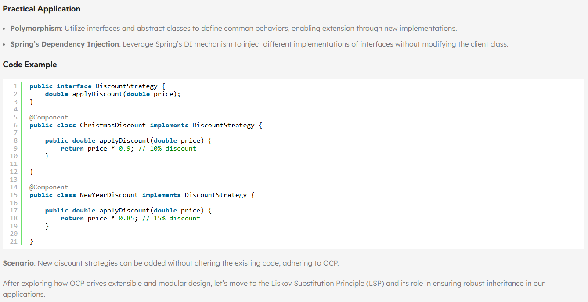
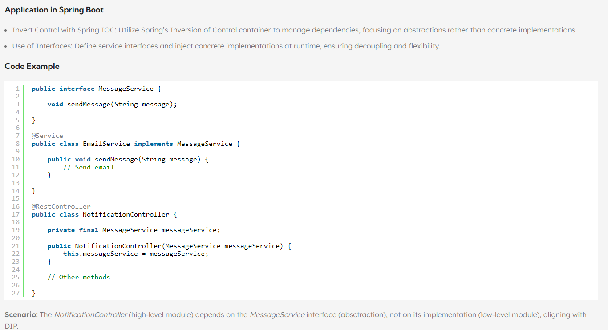

### Tell me about yourself:- 
- qualification - I have completed my graduation in Computer Engg from Pune University
- skillset - Currently working on Springboot and microservice having experience of different tools like Eureka, Api gatewar, Resilience4j, Actuator, Zipkin, Redis, Promotheus and Kafka
- domain - Currently working on telecom and having exp in ecommerce domain
- achievement - I can work as independent as well as a team member.
- responsibility - responsible for overseeing the development process, ensuring that coding standards are met, and guiding the team towards successful completion of projects. Also, mentors team of developers to achieve a project's goals. Basically I invovled from requirement gathering/analysis to post deployment processes like monitoring, bug fixes if any.
- That's it from my side, please let me know if u r looking for any other information

### why java?
portability - can run on any platform and it is opensource(free)\
security - it protects the customers from malicious script injection\
strong oops concepts - reusablity, performance etc.\
robust - it's reliable and efficient\
wildely used - simple prog. lang and easy to learn

### data types:
Primitive -
- byte: An 8-bit signed. Its range is from -128 to 127 (inclusive).
- short: A 16-bit signed. It can hold values from -32,768 to 32,767.
- int: A 32-bit signed. Its range is from -2,147,483,648 to 2,147,483,647. In Java SE 8 and later, you can use int to represent an unsigned 32-bit integer with a range from 0 to 2,147,483,647.
- long: A 64-bit. The signed long has a minimum value of -9,223,372,036,854,775,808 and a maximum value of 9,223,372,036,854,775,807. In Java SE 8, you can use long to represent an unsigned 64-bit long with a range from 0 to 18,446,744,073,709,551,615.
- float: A 32-bit floating-point type for fractional numbers. It can store approximately 6 to 7 decimal digits.
- double: A 64-bit floating-point type. It provides greater precision and can store approximately 15 decimal digits.
- boolean: A 1-bit type representing true or false.
- char: A 16-bit type that stores a single character or an ASCII value.
Non primitive - String, Array, Class, Interface and Enum

### Exception and types:
How to handle the error and represent to end user.\
Checked - it should be declare and we should handle the exception and we need to throw the error to base class. if we can not handle compiler will throw the error.

Example:
- ClassnotFoundException: when the JVM cannot find a class that is referred to by a Java program, Class.forName("com.mysql.jdbc.Driver"); Here mysqlconnector.jar is required to run.
- SQLException: Failed to connect to database because URL is wrong, Syntax error in SQL statement, Row/table in SQL statement does not
- IOException: Input or output operation is failed, File or directory not found, Incorrect file permissions

Unchecked - this should not be declared in the method signature and it can be thrown by any other method. compiler will not generate any error if they are not handled.

Example:
- NullpointerException
- ArrayIndexOutOfBoundException
- ArithmeticException: Divide by 0, Convert maximum long value to int

### Class vs Interface
A class contains properties, methods and constructors where as interface contains only abstract methods which has only signatures without any implementation.\
E.g Bank account stmt download(Abstract method - downloadStmt(type, data) ) - pdf format, csv format, json format

### Normal thread vs daemon thread
- A thread created by user/application/thread pool i.e. known as normal thread and JVM will take care(create, maintain and terminate) about this.
- These are the thread created by operating system to provide services to normal threads. They are low priority thread and only needed while user
threads are running. once the task is over JVM will terminate them even though daemon thread still running.(called as sema phores or monitors)

### OOPS concepts:
- Abstraction - process of hiding the implementation details and showing only the functionality to the users
- Encapsulation -  process of binding data and methods together in a single unit, providing controlled access to data
- Inheritance - 
- Polymorphism
- Overloading - multiple methods with same name and different parameters(prepare car - classic, suv, )
- Overriding - same params and same method name - functionality differs(download stmt)

### Difference between == and equals method:
== supports shallow comparison(check memory location) and equals supports Deep comparison(check value)

    String s1 = "hello";
    String s2 = new String(s1);
    String s3 = "hello";
    sysout("s1 equals s2"+ s1.equals(s2)); // true
    sysout("s1 == s2"+ s1==s2); //false
    sysout("s1 == s3"+ s1==s3); //true

### Abstract class vs Interface
Abstract classes are similar to normal classes but they can have abstract(only signature) methods which can not be instantiated.
Interfaces can only contains abstract methods and we can't write non abstract method inside interface

    Feature                 Abstract    Interface
    Instantiation           No          yes
    Abstract method         yes         yes
    Non abstract method     yes         no
    state                   yes         no
    can extend other class  yes         no
    implement other class   yes         yes
- Abstract class eg: baseController for error cases handling
- Interface eg: service layer implementation

### Priority queue:
It's an operating system feature.\
Its also data structure that stores the elements along with their priorities.(how to create priority queue, set priority). It allows efficient of the element retrieval based on priority.Schedule tasks we can use this.\
E.g. -> Banking sector -> Fund Transfer -> IMPS(Immediate), RTGS(Huge amount), NEFT(Take time and less money)

## Multithreading:
Is a programming concept, allows multiple tasks to be executed concurrently. In java multithreading can be implemented using Thread class. A thread object represents a single thread of execution.\
Advantages:
- increased performance
- improved responsiveness
- reduce resource storage
Did you used in real time/ where you have used it(scenario)?
Homeloan -> variable rate of interest -> RBI contols
I'm the developer of SBI who process the home loan. now
Avg 10 million people have home loan in pune -> RBI increased ROI 9.5 to 9.8 -> calculate 10 million people new WMI .

        for(int i =0; i<=10M; i++){             1000 customers -> thread1
                                                next 1000 -> thread2
        }

- Implement Thread using Runnable interface
    - https://github.com/SushantPoman/JavaBasics/blob/main/src/MultiThreading/RunnablePractice.java
- Implement Thread using Thread class
    - https://github.com/SushantPoman/JavaBasics/blob/main/src/MultiThreading/ThreadPractice.java
- Producer consumer model(using wait and notifiy)
    - https://github.com/SushantPoman/JavaBasics/blob/main/src/MultiThreading/ProducerConsumer.java
    - https://www.youtube.com/watch?v=4uQAokzfm-Q
- Sequential thread execution(using join)
    - https://github.com/SushantPoman/JavaBasics/blob/main/src/MultiThreading/SequentialExecution.java
    - https://www.geeksforgeeks.org/joining-threads-in-java/

### Thread lifecycle:
Threads go through various stages or phases during their lifetime. At any given moment, a thread exists in one of the following states:
1.	New State:
    - Occurs when a thread is created but not yet started.
    - The thread’s code has not yet begun execution.
    - It lies in the new state until the start() method is invoked.
2.	Runnable State:
    - A thread that is ready to run is moved to the runnable state.
    - In this state, a thread might actually be running or waiting for resource allocation.
    - The thread scheduler allocates time for each runnable thread to execute.
3.	Blocked State:
    - A thread enters the blocked state when it tries to acquire a lock that is currently held by another thread.
    - It remains blocked until it acquires the lock.
    - Once the lock is available, the thread moves back to the runnable state.
4.	Waiting State:
    - A thread enters the waiting state when it calls methods like wait() or join().
    - It waits for another thread to notify it or for the waiting thread to be terminated.
    - When notified, it transitions back to the runnable state.
5.	Timed Waiting State:
    - A thread enters this state when it calls a method with a time-out parameter (e.g., sleep or a conditional wait).
    - It remains in this state until the timeout expires or until it receives a notification.
6.	Terminated State:
    - A thread terminates due to either of the following reasons:
    - It exits normally after its code has been executed.
    - An unusual event occurs, such as an unhandled exception or a segmentation fault.
In Java, you can use the Thread.getState() method to get the current state of a thread. The java.lang.Thread.State enum defines constants for each thread state.\
yeild(), sleep()

### CompletableFuture:
https://tenusha.medium.com/running-multiple-tasks-in-parallel-with-completablefuture-and-custom-thread-pools-in-spring-boot-dc4bf0ee7d98

### Arrays vs LinkedList:

    Feature                 Array           Linkedlist
    Data storage            Contigoues      Non contigoues memory
    Access efficiency       High            Low
    Insertion/Deletion      Low             High
    Order of data           Important       Not Important
    E.g. (cases)            Only retrieval  Update data, add, remove

### Collections(uses):
- Main benefits of collection framework:
    - Reusabliity - Common classes and common util methods
    - Quality(Performance) - Code already tested an easy to write
    - Speed - JVM created the collection by taking performance in the criteria
    - Maintenance - Easy to maintain
- Root interface of collections is:
    - Collections
- Thread safe(avoid deadlocks) classes in java collection framework
    - Stack
    - Vector
    - Hashtable
    - BlockingQueue
    - ConcurrentMap
    - ConcurrentNavigatbleMap
- How you can remove elements efficiently while iterating a collection
        ListIterator<Integer> item = myList.iterator(); //concurrentModificationException not come in the listIterator
            while(item.hasNext()){
                item.remove();
        }
- Convert list into an array\
    int[] intArray = ArrayUtils.toPrimitive(myList.toArray(new Integer[0]));
- Collection.nCopies() -> can use while testing for multiple copies
    - It is going to return an immutable list which contains "n" copies of given object
- Collection.frequency
    - It counts the frequency of the specified element in the given list
- Collection.disjoint
    - It returns common element by comparing two datastructure
- Collection.Singleton
    - It created an immutable set over a specified collection
- Array vs ArrayList -
    - https://www.geeksforgeeks.org/array-vs-arraylist-in-java/
- ArrayList vs LinkedList - 
    - https://www.javatpoint.com/difference-between-arraylist-and-linkedlist
    - https://www.geeksforgeeks.org/arraylist-vs-linkedlist-java/
- Internal working of hashmap 
    - https://www.javatpoint.com/working-of-hashmap-in-java
    - https://www.youtube.com/watch?v=sw-j_ETGBEo&list=PL0zysOflRCen9SPmMO2XN1I2S9m96G_dx&index=3
    - Hashing(&)
        - https://madformath.com/calculators/basic-math/base-converters/decimal-to-binary-converter-with-steps/
decimal-to-binary-converter-with-steps#calc43
        - https://www.freecodecamp.org/news/java-operator-and-or-logical-operators/
- Internal working of hashset 
    - https://www.geeksforgeeks.org/internal-working-of-sethashset-in-java/
- Synchronized collection 
    - https://medium.com/@the_infinity/javas-synchronized-collections-07712ae3b2cb
- Hashtable:
    It's a data structure used to store key and value pair. Its an efficient data structure for storing and retrieving the data as we can access the data in constant time.
    - put(key, value) -> going to insert data in HashTable -> new bucket and add this item to the bucket
    - get(key) -> based on hashcode it retrievs the data
    - remove(key) -> removed the key and value pair from the hash table

### Streams Collections:
https://github.com/SushantPoman/JavaBasics/blob/main/src/Basics/Streams.java
https://github.com/SushantPoman/JavaBasics/blob/main/src/Basics/StreamsCustom.java
- Intermediate operations:
    - filter, map, flatMap, distinct, reduce, sorted, peek, limit, skip
- Terminal operations:
    - forEach, collect, reduce, allMatch, anyMatch, noneMatch, findFirst, findAny, max, min, toArray 
- Collectors:
    - joining, groupingBy, partitioningBy, counting, summarizingInt, averagingInt, mapping, teeing, toList, toSet, toMap, reducing, flatMapping, collectingAndThen, summarizingDouble

### Java 8 features:
- Functional programming
- DateTime Api - https://www.javatpoint.com/java-date
- Optional keyword in java:
To avoid NullPointerException in Java - we can use optional keyword\
Product prod = Product.getProduct("iPhone14");

#### Default Methods:
- Default methods allow you to add new functionality to existing interfaces without breaking the code in classes that implement those interfaces.
- They provide default implementations that can be optionally overridden by implementing classes.
- Use cases: Backward compatibility: You can extend an interface’s functionality without affecting already implemented classes.

        interface MyInterface {
            void regularMethod();
            default void defaultMethod() {
                System.out.println("Default method implementation");
            }
        }
        class MyClass implements MyInterface {
            public void regularMethod() {
            System.out.println("Regular method implementation");
            }
        }
        MyClass myObj = new MyClass();
        myObj.regularMethod(); // Output: Regular method implementation
        myObj.defaultMethod(); // Output: Default method implementation

#### Static Methods:
- Static methods in interfaces are similar to static methods in classes.
- They can be invoked on the interface itself without requiring an instance of the interface.
- Purpose: Organizing utility methods related to the interface.

        interface MyInterface {
            // Abstract method
            void regularMethod();
            // Static method with a default implementation
            static void staticMethod() {
                System.out.println("Static method implementation");
            }
        }
        MyInterface.staticMethod(); // Output: Static method implementation

These features enhance the flexibility and expressiveness of Java interfaces, making them more powerful and versatile.

### Comparable vs comparator
https://github.com/SushantPoman/JavaBasics/blob/main/src/Basics/CompareFields.java 
#### Comparable:
1.	The Comparable interface allows you to compare an object with other objects of the same type.
2.	It is used for the default ordering of objects.
3.	Classes that implement the Comparable interface override the compareTo() method to enable default ordering based on a specific attribute.
4.	The actual class is modified when implementing Comparable.
5.	Example: Suppose we have a Student class with attributes like rollno, name, and age. By implementing Comparable<Student>, we can sort a list of students based on their age.
#### Comparator:
1.	The Comparator interface is a functional interface that can sort objects.
2.	It provides multiple sorting sequences.
3.	Unlike Comparable, it does not modify the actual class.
4.	You can create custom comparators to sort objects based on different attributes.
5.	Example: If you want to sort students by name or roll number, you can create a custom Comparator for that specific sorting logic.
In summary:
- Use Comparable when you want to define the default ordering for objects within the same class.
- Use Comparator when you need custom sorting logic or want to sort objects based on different attributes.

### How to make java class as immutable:
Immutable class is a class which is once created, it’s contents can not be changed. Sometimes we need to create Immutable classes for some purposes such as not allowing outside world to modify the objects. We have several inbuilt classes in Java also. Some of them are:
String, Wrapper Classes, Arrays, LocalDate, LocalTime and etc...
Steps:
- The class must be declared as final so that child classes can’t be created.
- Data members in the class must be declared private so that direct access is not allowed.
- Data members in the class must be declared as final so that we can’t change the value of it after object creation.
- A parameterized constructor should initialize all the fields performing a deep copy so that data members can’t be modified with an object reference.
- Deep Copy of objects should be performed in the getter methods to return a copy rather than returning the actual object reference
https://www.geeksforgeeks.org/create-immutable-class-java/  

## SOLID principles:
1. Single Responsibility Principle
    - A class should have only one reason to change
    - eg. generate report, send report
    -   https://medium.com/@saygiligozde/applying-solid-principles-to-spring-boot-applications-191d7e50e1b3

            @RestController
            @RequestMapping("/report")
            public class ReportController {

                private final ReportService reportService;
                private final EmailService emailService;

                public ReportController(ReportService reportService, EmailService emailService) {
                    this.reportService = reportService;
                    this.emailService = emailService;
                }

                @PostMapping("/send")
                public ResponseEntity<Report> generateAndSendReport(@RequestParam String reportContent, @RequestParam String to,@RequestParam String subject) {
                    // correct impl reportService is responsible for generation
                    Long reportId = Long.valueOf(reportService.generateReport(reportContent));
                    // correct impl emailService is responsible for sending
                    emailService.sendReportByEmail(reportId, to, subject);
                    return new ResponseEntity<>(HttpStatus.OK);
                }
            }

2. Open-Closed Principle
    - Software entities (classes, modules, functions, etc.) should be open for extension, but closed for modification
    - spring's dependency injection Leverage Spring's DI mechanism to inject different implementations of interfaces without modifying the client class
    - eg. DiscountStrategy
    - https://numericaideas.com/blog/solid-principles-in-spring-boot/

    

        public interface NotificationService{
            public void sendOTP(String medium);
            public void sendTransactionNotification(String medium);
        }

        public class EmailNotification implements NotificationService{
            public void sendOTP(String medium){
                // write Logic using JavaEmail api
            }
            public void sendTransactionNotification(String medium){
            }
        }

        public class MobileNotification implements NotificationService{
            public void sendOTP(String medium){
            // write Logic using Twilio SMS API
            }
            public void sendTransactionNotification(String medium){
            }
        }

        public class WhatsAppNotification implements NotificationService{
            public void sendOTP(String medium){
            // write Logic using whatsapp API
            }
            public void sendTransactionNotification(String medium){
            }
        }
    - By using the Template Method pattern, we can add new notification services without modifying existing code, thus adhering to the OCP.

3. Liskov Substitution Principle
    - Derived or child classes must be substitutable for their base or parent classes"
    - e.g. https://www.jrebel.com/blog/solid-principles-in-java
    - e.g. https://medium.com/@javatechie/solid-design-principle-java-ae96a48db97

            public abstract class SocialMedia {
                public abstract void chatWithFriend();
                public abstract void publishPost(Object post);
                public abstract void sendPhotosAndVideos();
                public abstract void groupVideoCall(String... users);
            }

    - Due to publishPost() method whatsapp child is not substitute of parents SocialMedia because whatsapp doesn’t support upload photos and videos for friend it’s just a chatting application so it doesn’t follow LSP
    - Similarly instagram doesn’t support groupVideoCall() feature so we say instagram child is not substitute of parents SocialMedia
    - Solution:

            public interface SocialMedia {  
                public void chatWithFriend();
                public void sendPhotosAndVideos();
            }
            
            public interface SocialPostAndMediaManager { 
                public void publishPost(Object post);
            }

            public interface VideoCallManager{ 
                public void groupVideoCall(String... users);
            }

    - Whatsapp will implement SocialMedia and VideoCallManager. Similarly instagram will implement SocialMedia and SocialPostAndMediaManager.

4. Interface Segregation Principle
    - Do not force any client to implement an interface which is irrelevant to them
    - In other words, a class should only be required to implement the methods that are relevant to its behavior.
    - e.g https://amrtechuniverse.com/solid-principles-in-spring-boot

            public interface PaymentService {
                void processPayment(Order order);
            }

            public interface RefundService {
                void processRefund(Order order);
            }

            @Service
            public class PayPalPaymentService implements PaymentService, RefundService {
                @Override
                public void processPayment(Order order) {
                    // payment processing logic
                }

                @Override
                public void processRefund(Order order) {
                    // refund processing logic
                }
            }
    - By creating separate interfaces for different responsibilities, we ensure that classes only implement the methods they need, making the code more maintainable and readable.

5. Dependency Inversion Principle
    - Must use abstraction (abstract classes and interfaces) instead of concrete implementations. High-level modules should not depend on the low-level module but both should depend on the abstraction
    - https://numericaideas.com/blog/solid-principles-in-spring-boot/
    
    

## Design patterns:
https://www.youtube.com/watch?v=neSp9gap7Rw

### Creational:
1. Builder
    - Construct a complex object from simple objects using step-by-step approach
    - It's especially useful when you need to create an object with lots of possible configuration options. 
    - e.g. Spring(Kafka - topicBuilder while generating NewTopic, Servlet -SpringApplicationBuilder), Android (NotificaitonBuilder, AlertDialogBuilder)
    - SpringApplicationBuilder - Add more sources (configuration classes and components) to this application
    - https://github.com/SushantPoman/JavaBasics/blob/main/src/DesignPatterns/creational/DpBuilder.java

2. Factory
    - Define an interface or abstract class for creating an object but let the subclasses decide which class to instantiate. 
    - Factory Method Pattern allows the sub-classes to choose the type of objects to create. It promotes the loose-coupling by eliminating the need to bind application-specific classes into the code.. 
    - e.g. slf4j.LoggerFactory, SessionFactory, BeanFactory, PaymentMethodFactory(Custom)
    - https://github.com/SushantPoman/JavaBasics/blob/main/src/DesignPatterns/creational/DpFactory.java
    - Springboot - https://medium.com/@halilugur/factory-method-pattern-with-spring-boot-90c0f3ce93af

3. Singleton
    - Ensures that only one object of its kind exists and provides a single point of access to it for any other code
    - e.g. Logging service, utility classes, configuration (properties, environment variables, feature toggles), caching (Implement a singleton cache manager to store frequently accessed data in memory).
    - https://github.com/SushantPoman/JavaBasics/blob/main/src/DesignPatterns/creational/DpSingleton.java

4. Prototype
    - Cloning of an existing object instead of creating new one and can also be customized as per the requirement
    - When you need a new instance of a bean every time it's requested, such as maintaining per-client or per-request state, use the prototype scope
    - e.g. user session, shopping cart, generate unique tokens, random numbers
    - https://github.com/SushantPoman/JavaBasics/blob/main/src/DesignPatterns/creational/DpPrototype.java

### Structural:

1. Adapter
    - Converts the interface of a class into another interface that a client wants
    - The Adapter design pattern in Java is a structural pattern that allows the interface of an existing class to be used as another interface. It acts as a bridge between two incompatible interfaces, making them work together. This pattern involves a single class, known as the adapter, which is responsible for joining functionalities of independent or incompatible interfaces. 
    - https://github.com/SushantPoman/JavaBasics/blob/main/src/DesignPatterns/structural/DpAdapter.java
    - https://medium.com/@thecodebean/adapter-design-pattern-implementation-in-java-72f4a19af3c1

2. Facade:
    - Provide a unified interface to a set of interfaces in a subsystem. Facade Pattern defines a higher-level interface that makes the subsystem easier to use.
    - https://github.com/SushantPoman/JavaBasics/blob/main/src/DesignPatterns/structural/DpFacade.java
    - https://www.geeksforgeeks.org/facade-design-pattern-introduction/

    
### Behavioural:

1. Strategy:
    - Defines a family of functionality, encapsulate each one, and make them interchangeable. allowing clients to switch algorithms dynamically without altering the code structure. 
    - https://github.com/SushantPoman/JavaBasics/blob/main/src/DesignPatterns/behavioural/DpStrategy.java
    - https://www.javatpoint.com/strategy-pattern

2. Observer:
    - Define a dependency so that when one object changes state, all its dependents are notified and updated automatically 
    - Observer Design Pattern is a behavioral design pattern where an object, known as the subject, maintains a list of its dependents, called observers, that are notified of any changes in the subject's state. This pattern is often used to implement distributed event handling systems.
    - https://github.com/SushantPoman/JavaBasics/blob/main/src/DesignPatterns/behavioural/DpObserver.java
    - https://www.geeksforgeeks.org/observer-method-design-pattern-in-java/

### Java 8: March 18, 2014
- https://www.digitalocean.com/community/tutorials/java-8-features-with-examples
#### Features:
1. Lambda Expressions - 
Lambda expressions provide a clear and concise way to represent one method interface using an expression.

        import java.util.List;
        import java.util.stream.Collectors;
        import java.util.stream.Stream;

        public class LambdaExample {
            public static void main(String[] args) {
                List<String> list = Stream.of("one", "two", "three")
                                        .filter(s -> s.startsWith("t"))
                                        .collect(Collectors.toList());
                System.out.println(list); // Output: [two, three]
            }
        }

2. Functional Interfaces -
Functional interfaces are interfaces that have exactly one abstract method. They can be implicitly converted to lambda expressions.

        @FunctionalInterface
        interface Greeting {
            void sayMessage(String message);
        }

        public class FunctionalInterfaceExample {
            public static void main(String[] args) {
                Greeting greeting = message -> System.out.println("Hello, " + message);
                greeting.sayMessage("World"); // Output: Hello, World
            }
        }

3. Stream API - 
The Streams API provides a declarative way to process collections of objects.

        import java.util.List;
        import java.util.stream.Collectors;
        import java.util.stream.Stream;

        public class StreamsExample {
            public static void main(String[] args) {
                List<Integer> numbers = Stream.of(1, 2, 3, 4, 5)
                                            .filter(n -> n % 2 == 0)
                                            .collect(Collectors.toList());
                System.out.println(numbers); // Output: [2, 4]
            }
        }

4. Default Methods -
Default methods allow interfaces to have methods with implementations, which makes it easier to evolve interfaces.

        interface MyInterface {
            default void defaultMethod() {
                System.out.println("This is a default method");
            }
        }

        public class DefaultMethodExample implements MyInterface {
            public static void main(String[] args) {
                DefaultMethodExample example = new DefaultMethodExample();
                example.defaultMethod(); // Output: This is a default method
            }
        }

5. Optional Class - 
The Optional class is a container object which may or may not contain a non-null value. It helps to avoid null checks and NullPointerException.

        import java.util.Optional;

        public class OptionalExample {
            public static void main(String[] args) {
                Optional<String> optional = Optional.ofNullable("Hello, World");
                optional.ifPresent(System.out::println); // Output: Hello, World

                Optional<String> emptyOptional = Optional.ofNullable(null);
                System.out.println(emptyOptional.orElse("Default Value")); // Output: Default Value
            }
        }

6. New Date and Time API (java.time) - 
The new Date and Time API in java.time package provides a comprehensive and consistent model for date and time manipulation.

        import java.time.LocalDate;
        import java.time.LocalTime;
        import java.time.LocalDateTime;

        public class DateTimeExample {
            public static void main(String[] args) {
                LocalDate date = LocalDate.now();
                LocalTime time = LocalTime.now();
                LocalDateTime dateTime = LocalDateTime.now();

                System.out.println("Current Date: " + date);
                System.out.println("Current Time: " + time);
                System.out.println("Current DateTime: " + dateTime);
            }
        }
7. Method References - 
Method references in Java 8 provide a way to refer to methods without invoking them. They are a shorthand notation of a lambda expression to call a method. Method references can be used to refer to static methods, instance methods, or constructors.

    i. Reference to a Static Method - 
            
            import java.util.function.BiFunction;
            public class StaticMethodReferenceExample {
                public static void main(String[] args) {
                    BiFunction<Integer, Integer, Integer> adder = Math::addExact;
                    int result = adder.apply(10, 20);
                    System.out.println("Result: " + result); // Output: Result: 30
                }
            }
    ii. Reference to an Instance Method of a Particular Object - 

            import java.util.function.Function;
            public class InstanceMethodReferenceExample {
                public static void main(String[] args) {
                    String str = "Hello, World!";
                    Function<String, String> func = str::toLowerCase;
                    String result = func.apply(str);
                    System.out.println("Result: " + result); // Output: Result: hello, world!
                }
            }

    iii. Reference to an Instance Method of an Arbitrary Object of a Particular Type - 

            import java.util.function.BiFunction;
            public class ArbitraryObjectMethodReferenceExample {
                public static void main(String[] args) {
                    BiFunction<String, String, Boolean> func = String::equalsIgnoreCase;
                    boolean result = func.apply("java", "JAVA");
                    System.out.println("Result: " + result); // Output: Result: true
                }
            }
    iv. Reference to a Constructor - 

            import java.util.function.Supplier;
            class Message {
                private String msg;

                public Message() {
                    this.msg = "Default Message";
                }

                public Message(String msg) {
                    this.msg = msg;
                }

                public String getMsg() {
                    return msg;
                }
            }

            public class ConstructorReferenceExample {
                public static void main(String[] args) {
                    Supplier<Message> defaultMsgSupplier = Message::new;
                    Message defaultMsg = defaultMsgSupplier.get();
                    System.out.println(defaultMsg.getMsg()); // Output: Default Message

                    // Reference to a constructor with a parameter can be done using Function or other functional interfaces.
                    Function<String, Message> paramMsgSupplier = Message::new;
                    Message customMsg = paramMsgSupplier.apply("Custom Message");
                    System.out.println(customMsg.getMsg()); // Output: Custom Message
                }
            }

8. Nashorn JavaScript Engine
Java 8 introduced the Nashorn JavaScript engine, which allows you to run JavaScript code from within Java applications.

        import javax.script.ScriptEngine;
        import javax.script.ScriptEngineManager;
        import javax.script.ScriptException;

        public class NashornExample {
            public static void main(String[] args) throws ScriptException {
                ScriptEngine engine = new ScriptEngineManager().getEngineByName("nashorn");
                engine.eval("print('Hello from JavaScript')");
            }
        }
9. Base64 Encoding and Decoding - 
Java 8 introduced java.util.Base64 for Base64 encoding and decoding.
        
        import java.util.Base64;

        public class Base64Example {
            public static void main(String[] args) {
                String originalInput = "test input";
                String encodedString = Base64.getEncoder().encodeToString(originalInput.getBytes());
                System.out.println("Encoded String: " + encodedString);

                byte[] decodedBytes = Base64.getDecoder().decode(encodedString);
                String decodedString = new String(decodedBytes);
                System.out.println("Decoded String: " + decodedString);
            }
        }

Main features: functional programming concepts and improving the overall efficiency and expressiveness of Java code.

### Java 9 Features: September 21, 2017
1. Module System (Project Jigsaw) - 
The module system, also known as Project Jigsaw, introduced a new way to organize Java code. It helps in dividing the JDK into modules and also allows developers to create their own modules.
    
        module com.example.myapp {
            requires java.base;
            exports com.example.myapp;
        }
2. JShell: The Java REPL - 
JShell is a Read-Eval-Print Loop (REPL) for Java. It allows for interactive testing and debugging of Java code snippets.

        $ jshell
        |  Welcome to JShell -- Version 9
        |  For an introduction type: /help intro

        jshell> int x = 10;
        x ==> 10

        jshell> System.out.println(x * 2);
        20
3. Collection Factory Methods - 
Java 9 introduced factory methods for creating immutable collections like List, Set, and Map.

        import java.util.List;
        import java.util.Map;
        import java.util.Set;

        public class CollectionFactoryMethods {
            public static void main(String[] args) {
                List<String> list = List.of("one", "two", "three");
                Set<String> set = Set.of("a", "b", "c");
                Map<Integer, String> map = Map.of(1, "one", 2, "two");

                System.out.println(list);
                System.out.println(set);
                System.out.println(map);
            }
        }
4. Enhanced try-with-resources -
Java 9 allows using try-with-resources with resources that are not explicitly declared in the try-with-resources statement but are final or effectively final.

        import java.io.BufferedReader;
        import java.io.FileReader;
        import java.io.IOException;

        public class TryWithResources {
            public static void main(String[] args) throws IOException {
                BufferedReader reader = new BufferedReader(new FileReader("example.txt"));

                try (reader) {
                    System.out.println(reader.readLine());
                }
            }
        }
5. Private Methods in Interfaces -
Java 9 allows defining private methods in interfaces to share common code between default methods.

        interface MyInterface {
            default void defaultMethod() {
                privateMethod();
            }

            private void privateMethod() {
                System.out.println("Private method in interface");
            }
        }

        public class InterfacePrivateMethod implements MyInterface {
            public static void main(String[] args) {
                new InterfacePrivateMethod().defaultMethod();
            }
        }
6. HTTP/2 Client -
Java 9 introduced a new HTTP client API to support HTTP/2 and WebSocket, replacing the legacy HttpURLConnection.

        import java.net.URI;
        import java.net.http.HttpClient;
        import java.net.http.HttpRequest;
        import java.net.http.HttpResponse;

        public class HttpClientExample {
            public static void main(String[] args) throws Exception {
                HttpClient client = HttpClient.newHttpClient();
                HttpRequest request = HttpRequest.newBuilder()
                        .uri(new URI("http://example.com"))
                        .GET()
                        .build();
                HttpResponse<String> response = client.send(request, HttpResponse.BodyHandlers.ofString());

                System.out.println(response.body());
            }
        }

Main features: module system and enhancements to the Stream API and collection factories.

### Java 10 Features: March 20, 2018
1. Local Variable Type Inference (var) - 
Java 10 introduced the var keyword for local variable type inference, allowing you to declare variables without explicitly specifying their types.
        
        public class VarExample {
            public static void main(String[] args) {
                var str = "Hello, Java 10!";
                var numbers = List.of(1, 2, 3, 4, 5);
                System.out.println(str);
                System.out.println(numbers);
            }
        }
2. Unmodifiable Collections - 
Java 10 added static methods like List.copyOf(), Set.copyOf(), and Map.copyOf() to create unmodifiable copies of collections.

        import java.util.List;
        import java.util.Set;
        import java.util.Map;

        public class UnmodifiableCollections {
            public static void main(String[] args) {
                List<String> originalList = List.of("one", "two", "three");
                List<String> unmodifiableList = List.copyOf(originalList);
                
                // This will throw UnsupportedOperationException
                // unmodifiableList.add("four");
                
                System.out.println(unmodifiableList);
            }
        }
3. Optional.orElseThrow() -
Java 10 added the orElseThrow() method to Optional, OptionalDouble, OptionalInt, and OptionalLong to throw a NoSuchElementException if no value is present.

        import java.util.Optional;

        public class OptionalExample {
            public static void main(String[] args) {
                Optional<String> optional = Optional.empty();
                
                // This will throw NoSuchElementException
                // String value = optional.orElseThrow();
                
                System.out.println(optional.orElseThrow(() -> new NoSuchElementException("No value present")));
            }
        }
4. Time-Based Release Versioning -
Java 10 adopted a time-based release versioning scheme, with versions named as $FEATURE.$INTERIM.$UPDATE.$PATCH.
5. Parallel Full GC for G1 - 
Java 10 introduced parallel full garbage collection for the G1 garbage collector, improving performance.
6. Application Class-Data Sharing - 
Java 10 added support for application class-data sharing, which allows applications to share class metadata to reduce memory footprint and startup time.
7. Experimental Java-Based JIT Compiler - 
Java 10 included an experimental Java-based Just-In-Time (JIT) compiler, which can be enabled with the -XX:+UseExperimentalJVMFeatures option.
8. Heap Allocation on Alternative Memory Devices - 
Java 10 introduced support for allocating the Java heap on alternative memory devices, such as non-volatile memory.
9. Additional Unicode Language-Tag Extensions - 
Java 10 added support for additional Unicode language-tag extensions, allowing for more precise language and locale identification.
10. Thread-Local Handshakes - 
Java 10 introduced thread-local handshakes, which allow threads to perform operations without requiring a global VM state.

Main features: local-variable type inference and enhancements to garbage collection and class-data sharing.

### Java 11: September 25, 2018
- https://www.baeldung.com/java-11-new-features
- https://www.interviewbit.com/blog/java-11-features/
- https://www.youtube.com/watch?v=4EBA7xyw4rI
#### Features:
1. New var for Lambda Parameters - 
Java 11 allows the use of the var keyword to declare the formal parameters of an implicitly typed lambda expression.

        import java.util.List;

        public class VarLambdaExample {
            public static void main(String[] args) {
                List<String> names = List.of("John", "Jane", "Jack");

                // Using var in lambda expression
                names.forEach((var name) -> System.out.println(name));
            }
        }

2. Running Java Files with java Command - 
Java 11 enables the execution of a single-file program without explicitly compiling it first.

        // HelloWorld.java
        public class HelloWorld {
            public static void main(String[] args) {
                System.out.println("Hello, Java 11!");
            }
        }

        // Command to run the file
        $ java HelloWorld.java

3. New String Methods - 
Java 11 introduced several new methods in the String class.

        public class StringMethodsExample {
            public static void main(String[] args) {
                // isBlank
                System.out.println(" ".isBlank()); // true

                // lines
                String str = "Hello\nWorld\nJava 11";
                str.lines().forEach(System.out::println);

                // strip, stripLeading, stripTrailing
                String text = "  Hello  ";
                System.out.println(text.strip()); // "Hello"
                System.out.println(text.stripLeading()); // "Hello  "
                System.out.println(text.stripTrailing()); // "  Hello"

                // repeat
                String repeatStr = "Java";
                System.out.println(repeatStr.repeat(3)); // "JavaJavaJava"
            }
        }
4. Optional Enhancements - 
Java 11 added new methods to the Optional class.

        import java.util.Optional;

        public class OptionalExample {
            public static void main(String[] args) {
                Optional<String> optional = Optional.of("Hello");

                // isEmpty
                System.out.println(optional.isEmpty()); // false

                // ifPresentOrElse
                optional.ifPresentOrElse(
                    System.out::println,
                    () -> System.out.println("Value is not present")
                );
            }
        }
5. HTTP Client (Standard)
Java 11 standardizes the HTTP Client API, which was introduced as an incubator module in Java 9.
        import java.net.URI;
        import java.net.http.HttpClient;
        import java.net.http.HttpRequest;
        import java.net.http.HttpResponse;

        public class HttpClientExample {
            public static void main(String[] args) throws Exception {
                HttpClient client = HttpClient.newHttpClient();
                HttpRequest request = HttpRequest.newBuilder()
                        .uri(new URI("http://example.com"))
                        .GET()
                        .build();
                HttpResponse<String> response = client.send(request, HttpResponse.BodyHandlers.ofString());

                System.out.println(response.body());
            }
        }
6. Files Method Enhancements - 
Java 11 added new methods to the Files class to read and write strings to and from files.

        import java.nio.file.Files;
        import java.nio.file.Path;
        import java.nio.file.Paths;

        public class FilesExample {
            public static void main(String[] args) throws Exception {
                Path path = Paths.get("example.txt");

                // Write to file
                Files.writeString(path, "Hello, Java 11!");

                // Read from file
                String content = Files.readString(path);
                System.out.println(content);
            }
        }
7. Deprecate Nashorn JavaScript Engine - 
Java 11 deprecated the Nashorn JavaScript engine, which was introduced in Java 8.

Main features: enhancements to the HTTP Client, new String methods, and improved support for Unicode.

### Java 12: March 19, 2019
1. Switch Expressions (Preview) -
Switch expressions make switch statements more concise and expressive. The new syntax allows using lambda-like arrows for case labels.

        public class SwitchExpressionExample {
            public static void main(String[] args) {
                int day = 3;
                String dayType = switch (day) {
                    case 1, 2, 3, 4, 5 -> "Weekday";
                    case 6, 7 -> "Weekend";
                    default -> throw new IllegalArgumentException("Invalid day: " + day);
                };
                System.out.println(dayType);
            }
        }

2. Compact Number Formatting - 
The CompactNumberFormat class is introduced to format numbers in a more readable form (e.g., 1K, 1M).

        import java.text.NumberFormat;
        import java.util.Locale;

        public class CompactNumberExample {
            public static void main(String[] args) {
                NumberFormat nf = NumberFormat.getCompactNumberInstance(Locale.US, NumberFormat.Style.SHORT);
                System.out.println(nf.format(1000)); // Output: 1K
                System.out.println(nf.format(1000000)); // Output: 1M
            }
        }

3. File Mismatch Method - 
The Files.mismatch method is used to find the first mismatched byte position in the contents of two files.

        import java.nio.file.Files;
        import java.nio.file.Path;

        public class FileMismatchExample {
            public static void main(String[] args) throws Exception {
                Path file1 = Path.of("file1.txt");
                Path file2 = Path.of("file2.txt");
                long mismatch = Files.mismatch(file1, file2);
                if (mismatch == -1) {
                    System.out.println("Files are identical.");
                } else {
                    System.out.println("Files differ at byte position: " + mismatch);
                }
            }
        }

4. Pattern Matching for Instanceof (Preview) - 
This feature reduces the boilerplate code in instanceof checks.

        public class InstanceofExample {
            public static void main(String[] args) {
                Object obj = "Hello, world!";
                   if (obj instanceof String str) {
                    System.out.println(str.toUpperCase());
                }
            }
        }

5. New String Methods - 
Java 12 introduced new String methods like indent and transform.

        public class StringMethodsExample {
            public static void main(String[] args) {
                String text = "Java 12";
                System.out.println(text.indent(4)); // Indents the string by 4 spaces
                String result = text.transform(s -> s + " Features");
                System.out.println(result); // Output: Java 12 Features
            }
        }

### Java 13: September 17, 2019
1. Text Blocks (JEP 355) - 
Text blocks make it easier to work with multiline strings, eliminating the need for escape sequences.

        public class TextBlocksExample {
            public static void main(String[] args) {
                String sql = """
                    SELECT id, firstName, lastName
                    FROM Employee
                    WHERE departmentId = 'IT'
                    ORDER BY lastName, firstName
                    """;
                System.out.println(sql);
            }
        }

2. Switch Expressions (Second Preview) (JEP 354) - 
Switch expressions were introduced in Java 12 as a preview feature and have been enhanced in Java 13 with the yield statement.

        public class SwitchExpressionExample {
            public static void main(String[] args) {
                int day = 3;
                int numLetters = switch (day) {
                    case 1, 2, 3, 4, 5 -> yield 6;
                    case 6, 7 -> yield 7;
                    default -> throw new IllegalArgumentException("Invalid day: " + day);
                };
                System.out.println(numLetters);
            }
        }

3. Dynamic CDS Archives (JEP 350) - 
Dynamic Class-Data Sharing (CDS) archives make it easier to create and use CDS archives.

        // Example usage of Dynamic CDS Archives is typically done at the JVM level and not directly in code.

4. ZGC: Uncommit Unused Memory (JEP 351) - 
This feature improves the Z Garbage Collector by allowing the operating system to reclaim unused heap memory.

        // Example usage of ZGC improvements is typically done at the JVM level and not directly in code.

5. New Methods in String Class for Text Blocks - 
The String class has new methods to work with text blocks: formatted(), stripIndent(), and translateEscapes()

        public class StringMethodsExample {
            public static void main(String[] args) {
                String text = """
                    Hello
                    World
                    """;
                System.out.println(text.stripIndent());
                System.out.println(text.translateEscapes());
            }
        }

Main features: text blocks and enhancements to switch expressions

### Java 14: March 17, 2020
1. Records (Preview) - 
Records are a new kind of type declaration that is intended for use in data carrier classes. They provide a compact syntax for declaring classes that are transparent holders for shallowly immutable data.

        record Point(int x, int y) {}

        public class RecordsExample {
            public static void main(String[] args) {
                Point p = new Point(10, 20);
                System.out.println("Point: (" + p.x() + ", " + p.y() + ")");
            }
        }

2. Pattern Matching for instanceof (Preview) - 
This feature reduces boilerplate code in instanceof checks by allowing pattern matching directly in the condition.

        public class InstanceofExample {
            public static void main(String[] args) {
                Object obj = "Hello, world!";
                if (obj instanceof String str) {
                    System.out.println(str.toUpperCase());
                }
            }
        }

3. Helpful NullPointerExceptions (JEP 358) - 
This feature provides more detailed information when a NullPointerException is thrown, making it easier to debug issues.

        public class NullPointerExceptionExample { 
            public static void main(String[] args) { 
                String str = null; 
                str.length(); // This will throw a NullPointerException with a helpful message 
            } 
        }

4. Text Blocks (Second Preview) (JEP 368) - 
Text blocks allow for multiline string literals without the need for concatenation or escaping characters.

        public class TextBlocksExample {
            public static void main(String[] args) {
                String sql = """
                    SELECT id, firstName, lastName
                    FROM Employee
                    WHERE departmentId = 'IT'
                    ORDER BY lastName, firstName
                    """;
                System.out.println(sql);
            }
        }

5. ZGC on macOS and Windows (Experimental) - 
The Z Garbage Collector (ZGC) is now available on macOS and Windows, providing a low-latency garbage collector for large heaps.

        // Example usage of ZGC is typically done at the JVM level and not directly in code.

6. Foreign-Memory Access API (Incubator) - 
This feature allows Java programs to access memory outside the Java heap, which can be useful for high-performance applications.

        // Example usage of Foreign-Memory Access API is typically done at the JVM level and not directly in code.

Main features: records and enhancements to text blocks and garbage collection.

### Java 15: September 16, 2020
- https://www.baeldung.com/java-15-new
- https://iampravo.medium.com/java-15-a1bd6742dac8
#### Features:
1. Sealed Classes (Preview) - 
Sealed classes restrict which other classes or interfaces may extend or implement them.

        // Sealed class
        public sealed class Animal permits Dog, Cat {
            public void makeSound() {
                System.out.println("Animal sound");
            }
        }

        // Permitted subclass
        public final class Dog extends Animal {
            public void makeSound() {
                System.out.println("Bark");
            }
        }

        // Permitted subclass
        public final class Cat extends Animal {
            public void makeSound() {
                System.out.println("Meow");
            }
        }

        public class Main {
            public static void main(String[] args) {
                Animal animal = new Dog();
                animal.makeSound(); // Output: Bark
            }
        }

2. Hidden Classes (JEP 371) - 
Hidden classes are used for implementing dynamic proxies and other reflective operations without exposing the class to the outside world.

        import java.lang.invoke.MethodHandles;
        import java.lang.reflect.Proxy;

        public class HiddenClassesExample {
            public static void main(String[] args) {
                // Create a hidden class
                Class<?> proxyClass = Proxy.getProxyClass(
                    MethodHandles.lookup().lookupClass(),
                    Runnable.class
                );

                // Create an instance of the hidden class
                Runnable runnable = (Runnable) proxyClass.getConstructor().newInstance();
                runnable.run(); // This will do nothing, but it's an example of creating a hidden class
            }
        }

3. Pattern Matching for instanceof (Second Preview) - 
This feature reduces boilerplate code in instanceof checks by allowing pattern matching directly in the condition.

        public class InstanceofExample {
            public static void main(String[] args) {
                Object obj = "Hello, world!";
                if (obj instanceof String str) {
                    System.out.println(str.toUpperCase());
                }
            }
        }

4. Records (Second Preview) - 
Records are a new kind of type declaration that is intended for use in data carrier classes. They provide a compact syntax for declaring classes that are transparent holders for shallowly immutable data.

        record Point(int x, int y) {}

        public class RecordsExample {
            public static void main(String[] args) {
                Point p = new Point(10, 20);
                System.out.println("Point: (" + p.x() + ", " + p.y() + ")");
            }
        }

5. New String Methods - 
Java 15 introduced new String methods like formatted(), stripIndent(), and translateEscapes().

        public class StringMethodsExample {
            public static void main(String[] args) {
                String text = """
                    Hello
                    World
                    """;
                System.out.println(text.stripIndent());
                System.out.println(text.translateEscapes());
            }
        }

6. ZGC and Shenandoah Garbage Collectors (JEP 376) - 
ZGC and Shenandoah are low-latency garbage collectors optimized for large heaps and short pause times.

        // Example usage of ZGC and Shenandoah is typically done at the JVM level and not directly in code.

Main features: sealed classes and enhancements to garbage collection

### Java 16: March 16, 2021
1. Records (JEP 395) - 
Records are a new kind of type declaration intended for use in data carrier classes. They provide a compact syntax for declaring classes that are transparent holders for shallowly immutable data.

        record Point(int x, int y) {}

        public class RecordsExample {
            public static void main(String[] args) {
                Point p = new Point(10, 20);
                System.out.println("Point: (" + p.x() + ", " + p.y() + ")");
            }
        }

2. Pattern Matching for instanceof (JEP 394) - 
This feature reduces boilerplate code in instanceof checks by allowing pattern matching directly in the condition.

        public class InstanceofExample {
            public static void main(String[] args) {
                Object obj = "Hello, world!";
                if (obj instanceof String str) {
                    System.out.println(str.toUpperCase());
                }
            }
        }

3. Vector API (Incubator) (JEP 338) - 
The Vector API is in its initial incubation phase for Java 16. It provides a means of vector computations that can perform more optimally on supporting CPU architectures.

    // Example usage of Vector API is typically done at the JVM level and not directly in code.

4. Helpful NullPointerExceptions (JEP 358) - 
This feature provides more detailed information when a NullPointerException is thrown, making it easier to debug issues.

        public class NullPointerExceptionExample {
            public static void main(String[] args) {
                String str = null;
                str.length(); // This will throw a NullPointerException with a helpful message
            }
        }

5. New Stream Methods - 
Java 16 introduced new methods in the Stream API, such as toList() and mapMulti().

        import java.util.Arrays;
        import java.util.List;

        public class StreamMethodsExample {
            public static void main(String[] args) {
                List<String> integersAsString = Arrays.asList("1", "2", "3");
                List<Integer> ints = integersAsString.stream().map(Integer::parseInt).toList();
                System.out.println(ints); // Output: [1, 2, 3]
            }
        }

6. Day Period Support (JEP 351) - 
This feature adds support for day period formats in the DateTimeFormatter class, providing an alternative to the am/pm format.

        import java.time.LocalTime;
        import java.time.format.DateTimeFormatter;

        public class DayPeriodExample {
            public static void main(String[] args) {
                LocalTime date = LocalTime.parse("15:25:08.690791");
                DateTimeFormatter formatter = DateTimeFormatter.ofPattern("h B");
                System.out.println(date.format(formatter)); // Output: 3 in the afternoon
            }
        }
    
Main features: records and enhancements to the Stream API and garbage collection.

### Java 17: September 14, 2021
- https://www.baeldung.com/java-17-new-features
- https://javatechonline.com/java-17-features/
- https://www.youtube.com/watch?v=6DrYYLrzmvQ
#### Features:
1. Sealed Classes (JEP 409) - 
Sealed classes restrict which other classes or interfaces may extend or implement them.

        // Sealed class
        public sealed class Animal permits Dog, Cat {
            public void makeSound() {
                System.out.println("Animal sound");
            }
        }

        // Permitted subclass
        public final class Dog extends Animal {
            public void makeSound() {
                System.out.println("Bark");
            }
        }

        // Permitted subclass
        public final class Cat extends Animal {
            public void makeSound() {
                System.out.println("Meow");
            }
        }

        public class Main {
            public static void main(String[] args) {
                Animal animal = new Dog();
                animal.makeSound(); // Output: Bark
            }
        }

2. Pattern Matching for switch (Preview) (JEP 406) - 
This feature adds pattern matching to switch statements and expressions, making them more flexible and expressive.

        public class PatternMatchingExample {
            public static void main(String[] args) {
                String animal = "Dog";
                switch (animal) {
                    case "Dog", "Cat" -> System.out.println("It's a pet");
                    case "Lion" -> System.out.println("It's a wild animal");
                    default -> System.out.println("Unknown animal");
                }
            }
        }

3. Enhanced Pseudo-Random Number Generators (JEP 356) - 
This feature improves the performance and quality of pseudo-random number generators.

        import java.util.Random;

        public class RandomNumberExample {
            public static void main(String[] args) {
                Random random = new Random();
                System.out.println(random.nextInt()); // Generate a random integer
            }
        }

4. macOS/AArch64 Port (JEP 391) - 
This feature adds support for macOS on ARM64 architecture, making Java more compatible with modern hardware.

        // Example usage of macOS/AArch64 Port is typically done at the JVM level and not directly in code.

5. Deprecate the Applet API for Removal (JEP 403) - 
The Applet API is deprecated and scheduled for removal in future versions of Java.

        // Example usage of Applet API is typically done at the JVM level and not directly in code.

6. Strongly Encapsulate JDK Internals (JEP 398) - 
This feature strengthens the encapsulation of JDK internals, making it easier to maintain and evolve the JDK.

7. Context-Specific Deserialization Filters (JEP 415) - 
This feature adds support for context-specific deserialization filters, improving security and flexibility in deserialization.

        // Example usage of Context-Specific Deserialization Filters is typically done at the JVM level and not directly in code.

Main features: sealed classes and enhancements to pattern matching and random number generation.

### Java 18: March 22, 2022
1. UTF-8 by Default (JEP 400) - 
Java 18 sets UTF-8 as the default charset for the Java platform. This change ensures consistent behavior across different environments and simplifies the handling of text data.

        import java.nio.charset.Charset;

        public class CharsetExample {
            public static void main(String[] args) {
                Charset charset = Charset.forName("UTF-8", Charset.defaultCharset());
                System.out.println("Charset: " + charset.name());
            }
        }

2. Simple Web Server (JEP 408) - 
Java 18 introduced a simple web server as part of the JDK, making it easier for developers to run and test web applications without needing to set up a full-featured web server like Apache or Tomcat.

        import com.sun.net.httpserver.HttpServer;
        import java.io.IOException;
        import java.io.OutputStream;
        import java.net.InetSocketAddress;

        public class SimpleWebServer {
            public static void main(String[] args) throws IOException {
                HttpServer server = HttpServer.create(new InetSocketAddress(8000), 0);
                server.createContext("/hello", exchange -> {
                    String response = "Hello, World!";
                    exchange.sendResponseHeaders(200, response.getBytes().length);
                    OutputStream os = exchange.getResponseBody();
                    os.write(response.getBytes());
                    os.close();
                });
                server.start();
                System.out.println("Server started on port 8000");
            }
        }

3. Code Snippets in Java API Documentation (JEP 406) - 
Java 18 enhances the Java API documentation with code snippets, providing more practical examples and improving its usability.

        /**
        * This is an example method.
        *
        * <pre>{@code
        * ExampleClass example = new ExampleClass();
        * }</pre>
        */
        public class ExampleClass {
            public static void main(String[] args) {
                ExampleClass example = new ExampleClass();
            }
        }

4. Internet-Address Resolution SPI (JEP 407) - 
This feature adds a service provider interface (SPI) for internet address resolution, improving the flexibility and performance of network operations.

        // Example usage of Internet-Address Resolution SPI is typically done at the JVM level and not directly in code.

5. Vector API (Third Incubator) (JEP 338) - 
The Vector API is in its third incubation phase for Java 18. It provides a means of vector computations that can perform more optimally on supporting CPU architectures.

        // Example usage of Vector API is typically done at the JVM level and not directly in code.

6. Foreign Function & Memory API (Second Incubator) (JEP 412) - 
This feature allows Java programs to call native code and access memory outside the Java heap, which can be useful for high-performance applications.

        // Example usage of Foreign Function & Memory API is typically done at the JVM level and not directly in code.

7. Deprecate Finalization for Removal (JEP 409) - 
Finalization is deprecated and scheduled for removal in future versions of Java, encouraging developers to use alternative methods for cleanup.

        // Example usage of Finalization is typically done at the JVM level and not directly in code.

8. Terminally Deprecate Thread.stop(JEP 407) -
The Thread.stop method is terminally deprecated, and its use is strongly discouraged due to potential issues with thread safety.

        // Example usage of Thread.stop is typically done at the JVM level and not directly in code.

9. Remove Legacy PlainSocketImpl and PlainDatagramSocketImpl Implementation (JEP 409) - 
Legacy socket implementations are removed to simplify the Java networking stack and improve maintainability.

        // Example usage of Legacy Socket Implementations is typically done at the JVM level and not directly in code.

Main features: UTF-8 as the default charset and enhancements to the web server and API documentation.

### Java 19: September 20, 2022
1. Record Patterns (Preview) (JEP 405) - 
Record patterns enhance pattern matching by allowing records to be deconstructed in patterns. This feature is useful for working with data classes.

        record Point(int x, int y) {}

        public class RecordPatternsExample {
            public static void main(String[] args) {
                Point point = new Point(10, 20);
                if (point instanceof Point(int x, int y)) {
                    System.out.println("Point coordinates: (" + x + ", " + y + ")");
                }
            }
        }

2. Virtual Threads (Preview) (JEP 425) - 
Virtual threads are lightweight threads that aim to simplify writing, maintaining, and observing high-throughput concurrent applications.

        // Example usage of Virtual Threads is typically done at the JVM level and not directly in code.

3. Structured Concurrency (Incubator) (JEP 428) - 
Structured concurrency provides a way to manage multiple asynchronous tasks in a structured manner, making it easier to write concurrent code.

        // Example usage of Structured Concurrency is typically done at the JVM level and not directly in code.

4. Foreign Function & Memory API (Preview) (JEP 424) - 
This feature allows Java programs to call native code and access memory outside the Java heap, which can be useful for high-performance applications.

        // Example usage of Foreign Function & Memory API is typically done at the JVM level and not directly in code.

5. New Methods to Create Preallocated HashMaps - 
Java 19 introduces new factory methods to create preallocated HashMap instances, improving performance by reducing the need for resizing when the expected number of entries is known in advance.

        import java.util.HashMap;

        public class PreallocatedHashMapExample {
            public static void main(String[] args) {
                HashMap<String, Integer> map = HashMap.newHashMap(20);
                map.put("One", 1);
                map.put("Two", 2);
                map.put("Three", 3);
                System.out.println("HashMap: " + map);
            }
        }

6. Pattern Matching for switch (Third Preview) (JEP 427) - 
This feature adds pattern matching to switch statements and expressions, making them more flexible and expressive.

        public class PatternMatchingSwitchExample {
            public static void main(String[] args) {
                Object obj = "Hello, Java 19";
                switch (obj) {
                    case Integer i -> System.out.println("Integer: " + i);
                    case String s -> System.out.println("String: " + s);
                    case Double d -> System.out.println("Double: " + d);
                    default -> System.out.println("Unknown type");
                }
            }
        }

7. Automatic Generation of the CDS Archive (JEP 421) - 
This feature automatically generates the Class Data Sharing (CDS) archive, improving startup performance and reducing memory footprint.

        // Example usage of Automatic Generation of the CDS Archive is typically done at the JVM level and not directly in code.

8. Linux/RISC-V Port (JEP 422) - 
This feature adds support for Linux on RISC-V architecture, making Java more compatible with modern hardware.

        // Example usage of Linux/RISC-V Port is typically done at the JVM level and not directly in code.

9. Additional Date-Time Formats (JEP 423) - 
This feature adds support for additional date-time formats, providing more flexibility in handling date and time data.

        import java.time.LocalDateTime;
        import java.time.format.DateTimeFormatter;

        public class DateTimeExample {
            public static void main(String[] args) {
                LocalDateTime dateTime = LocalDateTime.now();
                DateTimeFormatter formatter = DateTimeFormatter.ofPattern("yyyy-MM-dd HH:mm:ss");
                System.out.println(dateTime.format(formatter));
            }
        }

10. New System Properties for System.out and System.err (JEP 424) - 
This feature adds new system properties to control the behavior of System.out and System.err.

        // Example usage of New System Properties for System.out and System.err is typically done at the JVM level and not directly in code.

Main features: record patterns, virtual threads, and enhancements to pattern matching and date-time formats.

### Java 20: March 21, 2023
1. Scoped Values (JEP 429) - 
Scoped values provide a modern alternative to thread-local variables, allowing data to be shared within and across threads in a more efficient and safe manner.

        import java.util.concurrent.atomic.AtomicInteger;
        import java.util.concurrent.atomic.AtomicReference;
        import java.util.concurrent.ThreadLocalRandom;
        import java.util.concurrent.ThreadLocalRandom;

        public class ScopedValuesExample {
            public static void main(String[] args) {
                AtomicInteger counter = new AtomicInteger(0);
                AtomicReference<String> message = new AtomicReference<>("Hello, Java 20!");

                // Using scoped values
                ScopedValue<Integer> scopedCounter = ScopedValue.of(counter.getAndIncrement());
                ScopedValue<String> scopedMessage = ScopedValue.of(message.getAndSet("Scoped values in action!"));

                System.out.println("Scoped Counter: " + scopedCounter.get()); // Output: 0
                System.out.println("Scoped Message: " + scopedMessage.get()); // Output: Hello, Java 20!

                // Scoped values are immutable and bound to the current thread
                System.out.println("Scoped Counter: " + scopedCounter.get()); // Output: 0
                System.out.println("Scoped Message: " + scopedMessage.get()); // Output: Scoped values in action!
            }
        }

2. Record Patterns (Second Preview) (JEP 432) - 
Record patterns, introduced in Java 19, are further enhanced in Java 20, providing more expressive and concise code.

        record Point(int x, int y) {}

        public class RecordPatternsExample {
            public static void main(String[] args) {
                Point point = new Point(10, 20);
                if (point instanceof Point(int x, int y)) {
                    System.out.println("Point coordinates: (" + x + ", " + y + ")"); // Output: Point coordinates: (10, 20)
                }
            }
        }

3. Pattern Matching for switch (Fourth Preview) (JEP 433) - 
Pattern matching for switch statements and expressions is further refined in Java 20, making them more flexible and expressive.

        public class PatternMatchingSwitchExample {
            public static void main(String[] args) {
                Object obj = "Hello, Java 20";
                switch (obj) {
                    case String s -> System.out.println("String: " + s); // Output: String: Hello, Java 20
                    case Integer i -> System.out.println("Integer: " + i);
                    case Double d -> System.out.println("Double: " + d);
                    default -> System.out.println("Unknown type");
                }
            }
        }

4. Foreign Function & Memory API (Second Preview) (JEP 434) - 
This feature allows Java programs to call native code and access memory outside the Java heap, which can be useful for high-performance applications.

        // Example usage of Foreign Function & Memory API is typically done at the JVM level and not directly in code.

5. Virtual Threads (Second Preview) (JEP 436) - 
Virtual threads are lightweight threads that aim to simplify writing, maintaining, and observing high-throughput concurrent applications.

        // Example usage of Virtual Threads is typically done at the JVM level and not directly in code.

6. Structured Concurrency (Second Incubator) (JEP 437)
Structured concurrency provides a way to manage multiple asynchronous tasks in a structured manner, making it easier to write concurrent code.

        // Example usage of Structured Concurrency is typically done at the JVM level and not directly in code.

7. Deprecations and Deletions
Java 20 includes several deprecations and deletions, such as the deprecation of java.net.URL constructors and changes to Thread.suspend/resume to throw UnsupportedOperationException.

        // Example usage of Deprecations and Deletions is typically done at the JVM level and not directly in code.

8. Other Changes - 
Java 20 also includes other changes, such as warnings about type casts in compound assignments with possible lossy conversions, idle connection timeouts for HTTP/2, and support for Unicode 15.0.

        // Example usage of Other Changes is typically done at the JVM level and not directly in code.

Main features: scoped values and enhancements to record patterns and pattern matching.

### Java 21: September 19, 2023
#### Features:
1. Record Patterns (JEP 440) - 
Record patterns, introduced in Java 19 and Java 20 as preview features, are now finalized in Java 21. They allow for more sophisticated data queries by deconstructing record class instances.

        record Point(int x, int y) {}

        public class RecordPatternsExample {
            public static void main(String[] args) {
                Point point = new Point(10, 20);
                if (point instanceof Point(int x, int y)) {
                    System.out.println("Point coordinates: (" + x + ", " + y + ")"); // Output: Point coordinates: (10, 20)
                }
            }
        }

2. Pattern Matching for switch (JEP 441) - 
Pattern matching for switch statements and expressions is further refined in Java 21, making them more flexible and expressive.

        public class PatternMatchingSwitchExample {
            public static void main(String[] args) {
                Object obj = "Hello, Java 21";
                switch (obj) {
                    case String s -> System.out.println("String: " + s); // Output: String: Hello, Java 21
                    case Integer i -> System.out.println("Integer: " + i);
                    case Double d -> System.out.println("Double: " + d);
                    default -> System.out.println("Unknown type");
                }
            }
        }

3. Sequenced Collections (JEP 442) - 
Java 21 introduces SequencedCollection, a new interface that extends Collection and ensures a predictable iteration order.

        import java.util.List;
        import java.util.ArrayList;

        public class SequencedCollectionsExample {
            public static void main(String[] args) {
                List<String> sequencedList = new ArrayList<>();
                sequencedList.add("First");
                sequencedList.add("Second");
                sequencedList.add("Third");

                // Accessing first and last elements
                System.out.println("First element: " + sequencedList.get(0)); // Output: First element: First
                System.out.println("Last element: " + sequencedList.get(sequencedList.size() - 1)); // Output: Last element: Third
            }
        }

4. Virtual Threads (JEP 444)
Virtual threads are now ready for production use in Java 21. They are lightweight threads managed by the JVM, allowing for high-throughput concurrent applications.

        import java.util.concurrent.ExecutorService;
        import java.util.concurrent.Executors;

        public class VirtualThreadsExample {
            public static void main(String[] args) {
                ExecutorService executor = Executors.newVirtualThreadPerTaskExecutor();
                executor.submit(() -> System.out.println("Inside Runnable"));
            }
        }

5. Enhanced Generics (JEP 443) - 
Java 21 enhances generics, providing more powerful and flexible ways to work with generic types.

        import java.util.List;
        import java.util.ArrayList;

        public class EnhancedGenericsExample {
            public static void main(String[] args) {
                List<Number> numbers = new ArrayList<>();
                numbers.add(1);
                numbers.add(2.5);
                numbers.add(3L);

                for (Number number : numbers) {
                    System.out.println(number);
                }
            }
        }

6. Improved Foreign Function & Memory API (JEP 445) - 
This feature allows Java programs to call native code and access memory outside the Java heap, which can be useful for high-performance applications.

        // Example usage of Foreign Function & Memory API is typically done at the JVM level and not directly in code.

7. Structured Concurrency (JEP 446) - 
Structured concurrency continues to be a preview feature, providing a way to manage multiple asynchronous tasks in a structured manner.

        // Example usage of Structured Concurrency is typically done at the JVM level and not directly in code.

8. String Templates (JEP 447) - 
String templates provide a new way to create formatted strings, making it easier to build complex strings with minimal code.

        public class StringTemplatesExample {
            public static void main(String[] args) {
                String name = "Java";
                int version = 21;
                System.out.println(f"Welcome to {name} {version}!"); // Output: Welcome to Java 21!
            }
        }

9. Unnamed Classes and Instance Main Methods (JEP 448) - 
This feature allows for the creation of unnamed classes and instance main methods, providing more flexibility in how code is organized.

        // Example usage of Unnamed Classes and Instance Main Methods is typically done at the JVM level and not directly in code.

10. Deprecate the Windows 32-bit x86 Port for Removal (JEP 449)
The Windows 32-bit x86 port is deprecated and scheduled for removal in future versions of Java.

        // Example usage of Deprecate the Windows 32-bit x86 Port for Removal is typically done at the JVM level and not directly in code.

Main features: record patterns, virtual threads, and enhancements to pattern matching and generics.

### Java 22: March 19, 2024
1. Unnamed Variables & Patterns (JEP 456) - 
This feature allows developers to define variables and patterns that are not used later in the code by replacing their names with an underscore (_).

        public record Employee(String name) {}

        public class UnnamedVariablesExample {
            public static void main(String[] args) {
                List<Employee> employees = List.of(new Employee("Alice"), new Employee("Bob"));
                
                // Using unnamed variable
                for (Employee _ : employees) {
                    System.out.println("Employee found");
                }
            }
        }

2. Launch Multi-File Source-Code Programs (JEP 458) - 
This feature allows launching programs that consist of several .java files without needing to compile them in advance.

        // Example.java
        public class Example {
            public static void main(String[] args) {
                System.out.println("Hello from Example.java");
            }
        }

        // AnotherExample.java
        public class AnotherExample {
            public static void main(String[] args) {
                Example.main(args);
            }
        }

3. Statements Before super(...) (Preview, JEP 447) - 
This feature allows executing code in constructors before calling super(...) or this(...).

        public class StatementsBeforeSuperExample {
            public StatementsBeforeSuperExample() {
                System.out.println("Before super()");
                super();
                System.out.println("After super()");
            }

            public static void main(String[] args) {
                new StatementsBeforeSuperExample();
            }
        }

4. Stream Gatherers (Preview, JEP 461) - 
Stream gatherers allow intermediate stream operations to be written more concisely.

        import java.util.stream.Collectors;
        import java.util.stream.Stream;

        public class StreamGatherersExample {
            public static void main(String[] args) {
                Stream<String> stream = Stream.of("apple", "banana", "cherry");
                String result = stream.collect(Collectors.joining(", "));
                System.out.println(result); // Output: apple, banana, cherry
            }
        }

5. Foreign Function & Memory API (JEP 454) - 
This feature allows Java programs to call native code and access memory outside the Java heap.

        // Example usage of Foreign Function & Memory API is typically done at the JVM level and not directly in code.

6. Class-File API (Preview, JEP 457) - 
This feature provides APIs for interacting with class files, allowing for more advanced manipulation and inspection of class files.

        // Example usage of Class-File API is typically done at the JVM level and not directly in code.

7. Structured Concurrency (Second Preview, JEP 462) - 
Structured concurrency provides a way to manage multiple asynchronous tasks in a structured manner.

        // Example usage of Structured Concurrency is typically done at the JVM level and not directly in code.

8. Scoped Values (Second Preview, JEP 464) - 
Scoped values provide a modern alternative to thread-local variables, allowing data to be shared within and across threads in a more efficient and safe manner.

        import java.util.concurrent.atomic.AtomicInteger;
        import java.util.concurrent.atomic.AtomicReference;
        import java.util.concurrent.ThreadLocalRandom;
        import java.util.concurrent.ThreadLocalRandom;

        public class ScopedValuesExample {
            public static void main(String[] args) {
                AtomicInteger counter = new AtomicInteger(0);
                AtomicReference<String> message = new AtomicReference<>("Hello, Java 22!");

                // Using scoped values
                ScopedValue<Integer> scopedCounter = ScopedValue.of(counter.getAndIncrement());
                ScopedValue<String> scopedMessage = ScopedValue.of(message.getAndSet("Scoped values in action!"));

                System.out.println("Scoped Counter: " + scopedCounter.get()); // Output: 0
                System.out.println("Scoped Message: " + scopedMessage.get()); // Output: Hello, Java 22!

                // Scoped values are immutable and bound to the current thread
                System.out.println("Scoped Counter: " + scopedCounter.get()); // Output: 0
                System.out.println("Scoped Message: " + scopedMessage.get()); // Output: Scoped values in action!
            }
        }

9. Vector API (Seventh Incubator, JEP 460) - 
The Vector API is in its seventh incubation phase, providing a means of vector computations that can perform more optimally on supporting CPU architectures.

        // Example usage of Vector API is typically done at the JVM level and not directly in code.

10. Deprecations and Deletions - 
Java 22 includes several deprecations and deletions, such as the removal of Thread.countStackFrames and the old core reflection implementation.

        // Example usage of Deprecations and Deletions is typically done at the JVM level and not directly in code.

11. Other Changes - 
Java 22 also includes other changes, such as region pinning for G1 and support for Unicode 15.1.

        // Example usage of Other Changes is typically done at the JVM level and not directly in code.

Main features: unnamed variables and patterns, and enhancements to structured concurrency and stream gatherers.

### Java 23: September 17, 2024
1. Markdown Documentation Comments (JEP 467) - 
Java 23 allows writing JavaDoc comments in Markdown, making documentation easier to read and write.

        /**
        * This method calculates the sum of two integers.
        *
        * @param a the first integer
        * @param b the second integer
        * @return the sum of `a` and `b`
        */
        public int add(int a, int b) {
            return a + b;
        }

2. Primitive Types in Patterns, instanceof, and switch (Preview) (JEP 455) - 
This feature extends pattern matching to support primitive types in instanceof and switch statements.

        public class PrimitivePatternExample {
            public static void main(String[] args) {
                int value = 5;
                if (value instanceof byte b) {
                    System.out.println("Value as byte: " + b); // Output: Value as byte: 5
                }
            }
        }

3. Module Import Declarations (Preview) (JEP 476) - 
This feature allows importing entire modules, simplifying the import process.

        // Example.java
        module example {
            requires java.base;
            exports com.example;
        }

4. Implicitly Declared Classes and Instance Main Methods (Third Preview) (JEP 477) - 
This feature allows creating classes and instance main methods without explicitly naming them

        // Example.java
        public class Example {
            public static void main(String[] args) {
                System.out.println("Hello, Java 23!");
            }
        }

5. Flexible Constructor Bodies (Second Preview) (JEP 482) - 
This feature allows initializing fields in constructors before calling super(...).

        public class FlexibleConstructorExample {
            private int value;

            public FlexibleConstructorExample(int value) {
                this.value = value;
                System.out.println("Initializing value: " + value);
                super();
            }

            public static void main(String[] args) {
                new FlexibleConstructorExample(10);
            }
        }

6. Stream Gatherers (Second Preview) (JEP 473) - 
Stream gatherers allow intermediate stream operations to be written more concisely.

        import java.util.stream.Collectors;
        import java.util.stream.Stream;

        public class StreamGatherersExample {
            public static void main(String[] args) {
                Stream<String> stream = Stream.of("apple", "banana", "cherry");
                String result = stream.collect(Collectors.joining(", "));
                System.out.println(result); // Output: apple, banana, cherry
            }
        }

7. Structured Concurrency (Third Preview) (JEP 480) - 
Structured concurrency provides a way to manage multiple asynchronous tasks in a structured manner.

        // Example usage of Structured Concurrency is typically done at the JVM level and not directly in code.

8. Scoped Values (Third Preview) (JEP 481) - 
Scoped values provide a modern alternative to thread-local variables, allowing data to be shared within and across threads in a more efficient and safe manner.

        import java.util.concurrent.atomic.AtomicInteger;
        import java.util.concurrent.atomic.AtomicReference;
        import java.util.concurrent.ThreadLocalRandom;
        import java.util.concurrent.ThreadLocalRandom;

        public class ScopedValuesExample {
            public static void main(String[] args) {
                AtomicInteger counter = new AtomicInteger(0);
                AtomicReference<String> message = new AtomicReference<>("Hello, Java 23!");

                // Using scoped values
                ScopedValue<Integer> scopedCounter = ScopedValue.of(counter.getAndIncrement());
                ScopedValue<String> scopedMessage = ScopedValue.of(message.getAndSet("Scoped values in action!"));

                System.out.println("Scoped Counter: " + scopedCounter.get()); // Output: 0
                System.out.println("Scoped Message: " + scopedMessage.get()); // Output: Hello, Java 23!

                // Scoped values are immutable and bound to the current thread
                System.out.println("Scoped Counter: " + scopedCounter.get()); // Output: 0
                System.out.println("Scoped Message: " + scopedMessage.get()); // Output: Scoped values in action!
            }
        }

9. Vector API (Eighth Incubator) (JEP 469) - 
The Vector API is in its eighth incubation phase, providing a means of vector computations that can perform more optimally on supporting CPU architectures.

        // Example usage of Vector API is typically done at the JVM level and not directly in code.

10. ZGC: Generational Mode by Default (JEP 474) - 
The Z Garbage Collector (ZGC) now uses generational mode by default, improving garbage collection performance.

        // Example usage of ZGC: Generational Mode by Default is typically done at the JVM level and not directly in code.

Main features: Markdown documentation, primitive types in patterns, and enhancements to structured concurrency and scoped values.