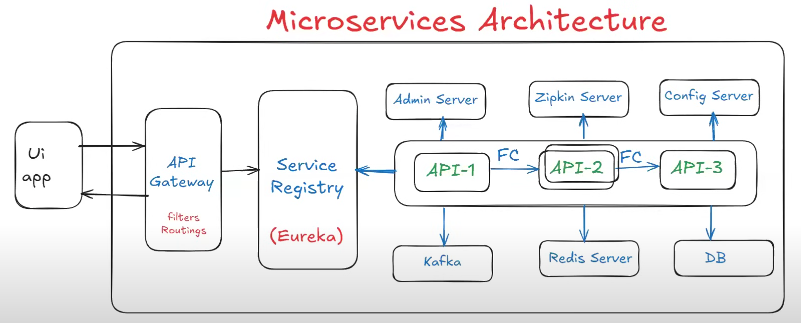
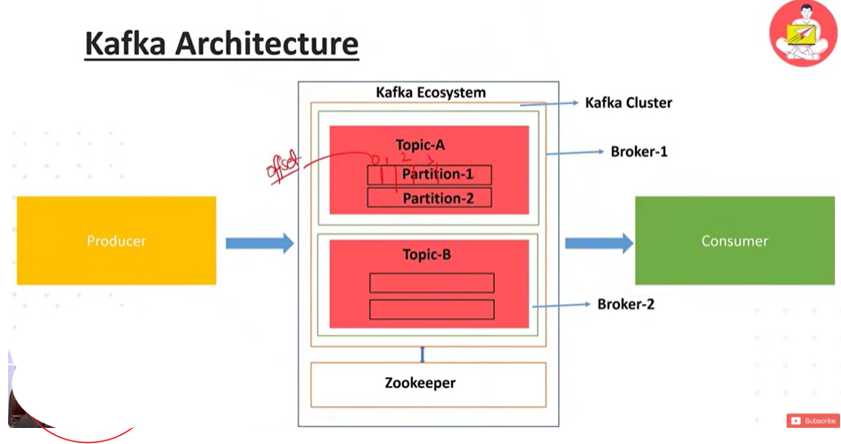
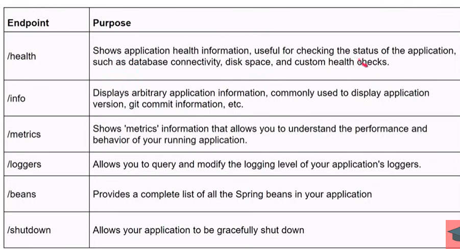
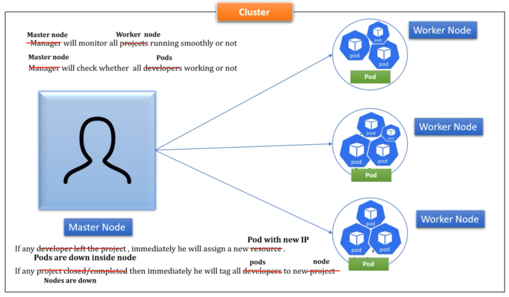
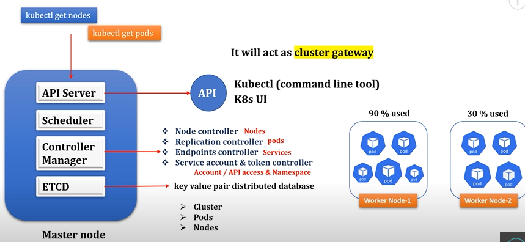

### Microservice:
Microservice is an architectural style of developing an application as a suite of small services, each capable of independently deployable, scalable.

                            Monlithic                           Microservice
    Developement        Single Language                     Each service can be writeen in different language 
    Testing             Full regression testing             Test the modified service
    Packaging           Single EAR/MSBuild file             Multiple jar/war files
    Runtime             Runs as a single process            Each service run in its process   
    Scalability         Replicating on multiple servers     Scale up only the service which needs to be scaled up
    Minor changes       Full rebuild and deployment         Only the service which changed is built and deployed
    Choose              Small app/Customer base             Large enterprise application  

### Microservices advantages:
- Loosely coupled
- Burden reduced on servers
- Easy maintenance
- No single point of failure
- Technology independent
- Quick deliverables

### Microservices challenges:
- Bounded context: It means identifying how many microservice we need to develop for one application and deciding which functionality we need to add in which microservice.
- Repeated configuration: In several microservice we need to write same configurations like data source, kafka, redis, eureka, resilience4j, security
- Visibility: As a developer you will get a chance to work on specific microservice and you will not get complete view of application

### Why Spring Boot for Microservices?:
Spring Boot is an excellent choice for microservices development due to its features:
- Embedded Server Support: Spring Boot includes embedded servers (like Tomcat or Jetty), simplifying deployment.
- Load Balancer: It supports load balancing for distributing requests across instances.
- Auto Configuration: Spring Boot automatically configures components based on conventions.
- Minimal Code using Annotations: Annotations reduce boilerplate code.
- Loose Coupling: Microservices can be independently developed and deployed.
- Dependency Management: Spring Boot manages dependencies efficiently.
- Open Source: It’s a vibrant open-source community1.

### Spring boot disadvantages:
- Lack of Control:
Spring Boot abstracts away much of the configuration and setup, which can be beneficial for rapid development.
However, this opinionated design may not suit projects with unique requirements.
Developers might feel limited in customization due to Spring Boot’s predefined conventions1.
- Large Deployment File Size:
Spring Boot creates many unused dependencies, resulting in a larger deployment file.
This can impact deployment time and resource utilization.
If minimizing the deployment size is critical, developers need to be cautious23.
- Conversion Process:
Converting an existing Spring project into a Spring Boot application can be complex and time-consuming.
Developers may face challenges when migrating legacy code to Spring Boot23.
- Not Suitable for Large-Scale Projects:
While Spring Boot is excellent for microservices and smaller applications, it might not be the best fit for large-scale projects.
For extensive enterprise-level systems, other Spring frameworks or custom configurations may be more appropriate23.
Remember that Spring Boot’s benefits often outweigh its disadvantages, especially for smaller projects or when rapid development is crucial. However, understanding these limitations helps make informed decisions when choosing the right framework for your specific use case

### Microservices architecture:

### Bean lifecycle:
In Spring, the bean lifecycle refers to the stages a bean goes through from its instantiation to its destruction. Let’s explore this process:
1.	Bean Definition Acquisition:
    - The Spring container reads the bean definitions from configuration files (such as XML or Java-based configuration).
    - It acquires the necessary information about the beans, including their class, properties, and lifecycle callbacks.
2.	Bean Creation and Instantiation:
    - The Spring container creates an instance of the bean based on the bean definition.
    - It uses the bean’s class and constructor to instantiate the object.
    - Dependencies are injected into the bean during this phase.
3.	Populating Bean Properties:
    - After instantiation, Spring sets the properties of the bean.
    - Property values are either directly injected or resolved from external configuration files.
4.	Post-Initialization:
    - If the bean implements the InitializingBean interface or defines an init-method, Spring calls the corresponding method.
    - This phase allows you to perform any custom initialization logic for the bean.
5.	Ready to Serve:
    - The bean is now fully initialized and ready for use.
    - It can be injected into other components or accessed by the application.
6.	Pre-Destroy:
    - When the Spring container is shutting down (e.g., during application shutdown), it calls the bean’s destroy-method (if defined).
    - Use this phase to release resources or perform cleanup tasks.
In summary, the Spring container manages the entire lifecycle of a bean, from creation to destruction. You can customize this lifecycle by implementing callback methods or using annotations.
- https://medium.com/@sendvjs/spring-bean-life-cycle-9363332c335e
- https://digitalocean.com/community/tutorials/spring-bean-life-cycle 

### REST API Design Guidelines:
- https://www.javaguides.net/2018/06/restful-api-design-best-practices.html#google_vignette
- https://medium.com/@avocadi/building-restful-apis-with-spring-boot-a-comprehensive-guide-2a7bf72aeea6

### Scopes in spring:
- https://www.baeldung.com/spring-bean-scopes
- https://jayamaljayamaha.medium.com/bean-scopes-in-java-springboot-e1e3c5874b51 - Image
- https://docs.spring.io/spring-framework/reference/core/beans/factory-scopes.html

## Redis cache:
Remote Dictionary Server, aka Redis, an in-memory data store, is one of the many options for implementing caching in Spring Boot applications due to its speed, versatility, and simplicity of use. It is a versatile key-value store that supports several data structures, such as Strings, Sorted Sets, Hashes, Lists, Streams, Bitmaps, Sets, etc., because it is a NoSQL database and doesn’t need a predetermined schema.
Use the following steps to configure any given cache provider:
1. Add the @EnableCaching annotation to the configuration file.
2. Add the required cache library to the classpath.
3. Add the cache provider configuration file to the root classpath.

https://github.com/SushantPoman/UserService/commit/a4b0131deda0ed55facc969b0d0a128c215f59a4
https://medium.com/simform-engineering/spring-boot-caching-with-redis-1a36f719309f

## Service Registry:
- It is used to maintain all apis information like name, status, url and health at one place. Also called as service discovery.
- We can use "Eureka server" as service registry. Provided by "Spring cloud" library.
- Eureka server is used to provide a dashboard with the information of all microservices available in application
- Note-1: If "Service-Registry" project port is 8761 then clients can discover service-registry and will register automatically with service-registry.
- Note-2: If service-registry project running on any other port number then we have to register clients with service-registry manually. To register manually in microservice properties we will use service-url.defaultZone property.
- Steps to develop Service Registry Application (Eureka Server)
    1) Create SpringBoot application with below dependency
        - Eureka Server (spring-cloud-starter-netflix-eureka-server) - devtools
    2) Configure @Enable EurekaServer annotation in boot start class
    3) Configure below properties in application.yml file

            spring: 
                application:
                    name: EurekaServer
            server:
                port: 8761
            eureka:
                client:
                    register-with-eureka: false
    4) Once application started access it using URL - http://localhost:8761/

## Api gateway:
- It acts as entry point for all the backend apis
- It acts as mediator between frontend app and backend apis
- In Api gateway we will write filters and routings
    - Filter: we can perform pre-process and post-process(Request validation)
    - Routings: To forward request to perticular backend-api

## Admin server:
- It is used to monitor and manage all the apis at one place.
- It provides user interface to access all apis actuator endpoints at one place.
- Eg.
    - Health checks
    - Config properties
    - URL mappings
    - Beans loaded
    - Change log levels
    - Thread dumps
    - Heap dumps
- Steps to develop Spring Admin Server
    1) Create Boot application with "admin-server" dependency (select it while creating the project)
    2) Configure @EnableAdminServer annotation at start class
    3) Change Port Number (Optional)

            spring:
                application:
                    name: AdminServer
            server:
                port: 1111
    4) Run the boot application
    5) Access application URL in browser (We can see Admin Server UI) - http://localhost:1111/

## Feign:
- It is used for interservice communication(Spring cloud library)
- Declarative web service client designed to make writing HTTP clients easier
- If one api communicate with another api with in the same application then it is called as inter service application
- Code snippet

            
            @FeignClient(name="Nelcome-Service")
            public interface Welcome FeignClient {
                @GetMapping("/welcome")
                public String getWelcomeMsg();
            }
            
            @RestController
            public class GreetRestController {
                @Autowired
                private Welcome FeignClient welcomeClient;
                
                @GetMapping("/greet")
                public String getGreetMsg() {
                    String welcomeMsg = welcomeClient.getWelcomeMsg();
                    String greetMsg = "Good Morning, ";
                    return greetMsg + welcomeMsg;
                }
            }

- Embarkx - https://www.youtube.com/watch?v=EeQRAxXWDF4&t=1s

## Zipkin:
- It is used for distributed tracing of our requests
- It provides user interface to access apis execution details
- Eg.
    - How much time taking to process one request
    - Which microservice taking more time to process
    - How many services involved in one request processing
- Steps to work with Zipkin Server
    1) Download Zipin Jar file
    URL: https://zipkin.io/pages/quickstart.html
    2) Run zipkin jar file:- 
        $ java -jar <jar-name>
    3) Zipkin Server Runs on Port Number 9411
    4) Access zipkin server dashboard using URL: http://localhost:9411/

## Sample Microservice development:
- Steps to develop WELCOME-API(acting as a client for eureka, admin, zipkin):
    1) Create Spring Boot application with below dependencies
        - eureka-discovery-client
        - admin-client
        - zipkin
        - starter-web
        - devtools
        - actuator
        - openfeign(interservice communication)
    2) Configure @EnableDiscoveryClient annotation at boot start class.
    3) Create RestController with required method
       
            @RestController
            public class Welcome {
                @GetMapping("/welcome")
                public String getWelcomeMsg() {
                    String msg = "Welcome To Ashok IT..!!"; return msg;
                }
            }
    4) Configure below properties in application.yml file

            spring:
                application:
                    name: 04_Welcome_Service
                boot:
                    admin:
                        client:
                            url: http://localhost:1111/
            server:
                port: 8081 
            eureka:
                client:
                    service-url:
                        defaultZone: http://localhost:8761/eureka/
            management:
                endpoints:
                    web:
                        exposure:
                            include: '*'
    
    5) Run the application and check in Eureka Dashboard (It should display in eureka dashboard)
    6) Check Admin Server Dashboard (It should display) (we can access application details from here)
        Ex: Beans, loggers, heap dump, thred dump, metrics, mappings etc...
    7) Send Request to REST API method
    8) Check Zipkin Server UI and click on Run Query button
        (it will display trace-id with details)

## Config server:
- It is used to separate application code and application properties
- It is used to externalize config props of our application
- It makes our application loosely coupled with properties file or yml file

## Security:
- AWS Lambda Authorizer:
    - https://manosmargaritis.medium.com/building-an-aws-lambda-function-authorizer-with-java-and-spring-boot-ed7acd7b6a25
    - https://github.com/SushantPoman/AWSLambda/commit/af4c98d986a34b2ba48dc6ef0ea20f803957a9a2

    Console output:
    - Success ->\
    Response: 130021560795
    Policy: PolicyDocument [versionString=2012-10-17, statements=[Statement [action=execute-api:Invoke, effect=Allow,resoure=arn:aws:execute-api:eu-west-2:null:null:*:*:*]]]
    - Failure ->\
    Response: null 
    Policy: PolicyDocument [versionString=2012-10-17, statements=[Statement [action=execute-api:Invoke, effect=Deny, resoure=arn:aws:execute-api:eu-west-2:null:null:*:*:*]]]

- JWT with DB:
    - https://www.unlogged.io/post/integrating-jwt-with-spring-security-6-in-spring-boot-3
    - https://github.com/SushantPoman/JWTwithDbss

- OAuth 2.0 with JWT and DB:
    - https://medium.com/@burakkocakeu/spring-security-oauth-and-jwt-fa7a893a6123
    - https://www.geeksforgeeks.org/spring-boot-oauth2-with-jwt/
    - https://www.toptal.com/spring/spring-boot-oauth2-jwt-rest-protection 

- Secure Api using Api key and secret:
    - https://www.geeksforgeeks.org/securing-spring-boot-api-with-api-key-and-secret/
    - https://github.com/SushantPoman/SecureApi/commit/be78b44ae9efaa2e486f82c0f7fbe70813640f74

## Kafka:
- Apache kafka is like a communication system that helps different parts of computer system exchange data by publishing and subscribing to topics.
- Zookeeper used to manage topics/partition/cluster using api gateway technique.

- Publishing topics: https://github.com/SushantPoman/OrderService/commit/70aa7903ca3ca5b59bc9ec7f3ac368b22839f567
- Subscribing topics: https://github.com/SushantPoman/UserService/commit/6701600c8d32b6060b8307d6c93cf2d049887685

References:
- Official - https://kafka.apache.org/documentation/
- Durgesh - https://www.youtube.com/watch?v=ei6fK9StzMM
- AshokIt - https://www.youtube.com/watch?v=19n9usmc2l8

## Jenkins:
Jenkins is used to automate build and deployment process
- AshokIt - https://www.youtube.com/watch?v=4cG7dWKbrC8

## Docker:
Docker is a open source platform for developing, shipping and  running application in  containers. Containers are light weight, isolated environment that package applications and their dependencies. 

- Images - Docker images are the templates that define the container and its dependencices
- Container - Containers are runtime environments created from docker images
- Docker engine - The docker engine is the runtime that runs and manages containers
- Dockerfile -  Is a file that contains instructions to build a Docker image
- DockerHub - DockerHub is cloud based registry that hosts a vast collection of Docker images

create img from mvn wrapper:
./mvnw spring-boot:build-image "-Dspring-boot.build.image.imageName=dcode007/companyms"

Dockerfile inside springboot:

    FROM openjdk:17
    EXPOSE	8080
    ADD target/kubernetespractice.jar kubernetespractice.jar
    ENTRYPOINT ["java","-jar","/kubernetespractice.jar"]

- Embarkx - https://www.youtube.com/watch?v=BLlEgtp2_i8
- Ashokit - https://www.youtube.com/watch?v=8dccz7ca4FM

## AWS
- Application load balancer
- Route 53
- VPC public and private subnet
- Auto scaling
- cloudfront - cdn, domain name, public and private certificates,
- WAF - web application firewall

## Actuator:
- Provides built in production ready features to monitor and manage your application.
- Provides endpoint like /actuator, /actuator/health, /actuator/metric
- This helps us to monitor data like threads, cache, requests, jvm memory
- Spring boot to actuator provides all this details with the micrometer data provider.
Features:
- Built in endpoints
- Ability to view real time metrics
- /metrics/health - status of the application
- /metrics/beans - all beans used in our application

## Micrometer:
- Monitoring system vendors are Prometheus, AWS cloudwatch, Netflix Atlas, Graphana
- All this vendors need data in different different formats to process and display the output in graphical representation - Micrometer converts this metrics data to the vendor required formats. (Taking data from actuator)

## Prometheus:
- It is a in memory dimensional time series database and it is designed to operate on a pool model (It pulls the metrics from application periodically).
- It also supports custom query language and math operation to extract the relevant metrics data
- Imp - https://blog.devops.dev/send-email-alerts-using-prometheus-alert-manager-16df870144a4

## Kubernetes:
Kubernetes is an open-source container-orchestration engine or container management tool, it automates deploying, scaling, and managing containerized application.

- Container - Docker
- Management - Deploying, scheduling, scaling, load balancing, self healing, roll back, monitoring

Components - Pods, Nodes, Cluster, Replica set, Service, Deployment, Secrets, Config Map, ETCD

Set default context:
- docker context use default

Deploy application using commands:
- minikube version
- minikube start --driver=docker (Use docker as platform to make to minikube cluster up)
- minikube status
- kubectl cluster-info
- kubectl get nodes
- minikube docker-env   (Use docker inside minikube)
- copy last line from above cmd output and paste as next cmd
- docker images     (To check docker images)
- docker build -t spring-k8s-practice:1.0 .     (After navigating to project directory)
- docker images     (To check img is created or not)
- kubectl create deployment spring-k8s-practice --image=spring-k8s-practice:1.0 --port=8080
- kubectl get deployment
- kubectl describe deployment spring-k8s-practice
- kubectl get pods
- kubectl logs  (use pod_name here)
- kubectl get deployment
- kubectl expose deployment spring-k8s-practice --type=NodePort
- kubectl get service
- minikube service spring-k8s-practice --url    (To get the url inside container where our application is running)
- minikube dashboard
- kubectl delete service spring-k8s-practice
- kubectl delete deployment spring-k8s-practice
- docker rmi kubernetespractice:1.0 (Image:tag)
- minikube stop \
Application - https://github.com/SushantPoman/KubernetesPractice/commit/5ef37cf101dda23290f7a3ea46f7af2bd1faf7d0

Deploy application using yaml:
- minikube version
- minikube start --driver=docker (Use docker as platform to make to minikube cluster up)
- minikube status
- minikube docker-env   (Use docker inside minikube)
- copy last line from above cmd output and paste as next cmd
- navigate to current project directory
- mvn clean install -DskipTests=true
- docker build -t spring-k8s-practice:1.0 .
- docker images     (To check docker images)
- kubectl apply -f k8s-deployment.yaml
- kubectl apply -f k8s-service.yaml \
Application - https://github.com/SushantPoman/KubernetesPractice/commit/05961da31fd539bcb0f5d8c719826680197a9be7

